# 说明

- 本仓库是服务端开发工程师的面试指南
- 部分内容素材来源于网上，一些已标明出处。如有侵权，请联系我删除
- 最后，希望大家都能收到心仪的offer

## 大纲如下

- C++
- 内存管理
- 数据结构
- 操作系统
- Linux
- 数据库
- 计网
- 网络编程
- 排序
- 并发
- Java
- 设计模式
- 海量数据
- 算法题

---

# C++

## C和C++的区别

- C是一个结构化语言，重点在于算法和数据结构。
- C考虑的是如何通过一个过程，对输入进行运算处理得到输出，面向过程的；C++，首要考虑的是如何构造一个对象模型，让这个模型能够配合对应的问题
- C++拓展了面向对象设计的内容，像类、继承、虚函数、模板和容器
- C++需要考虑数据封装，对象接口的设计和继承、组合与继承的使用

## Python和C++的区别

- python是一种先编译后解释的语言，`.pyc`文件是由`.py`文件经过编译后生成的字节码文件；C++是一种编译语言，完整的源代码将直接编译为机器代码，由CPU直接执行
- Python既是动态类型语言，运行时进行类型检查；C++是一种静态类型的语言，变量类型在编译时检查
- Python使用垃圾回收器进行内存管理；C++没有垃圾回收器
- 运行效率上C++要比Python快

## 编程范式

编程范式分为四种，分别是：面向过程编程，面向对象编程，泛型编程，函数式编程

- 面向过程编程（Procedure Programming, PP）：
- 面向对象编程（Object Oriented Programming, OOP）：利用类层级及虚函数进行编程，从而可以通过接口操作各种类型的对象，并且程序本身也可以通过派生进行功能增量扩展
- 泛型编程（Generic Programming，GP）：独立于任何特定类型的方式编写代码，模板，本质是屏蔽数据和操作数据的细节，让算法更为通用，让编程者更为关注算法的结构
- 函数编程：把运算过程尽量写成一系列嵌套的函数调用
  - 不依赖于外部的数据，而且也不改变外部数据的值
  - 把函数当成变量来用，关注于描述问题而不是怎么实现


## 多态

多态指的是同一名字的事物可以完成不同的功能。多态可以分为编译时的多态和运行时的多态。

- 静态多态：函数重载（包括运算符的重载）、模板
- 动态多态：继承、虚函数等概念有关

## 虚函数

虚函数：为了实现多态性，能够用一种方式去调用同一类族中不同类的同名函数；允许在派生类中重新定义与基类同名的函数，并且可以通过基类指针或引用来访问基类和派生类中的同名函数

### 虚函数表的原理

- 虚表是一个指针数组，其元素是虚函数的指针，每个元素对应一个虚函数的函数指针

- 虚表的构造（虚函数指针的赋值）发生在编译器的编译阶段

- 虚表属于类，存储在静态存储区，对象`this`内部包含一个虚表指针，来指向虚表
- 一个类只需要一个虚表即可，同一个类的所有对象都使用同一个虚表

虚函数的调用关系：this -> vptr -> vtable ->virtual function

参考：

https://zhuanlan.zhihu.com/p/75172640

### 调用虚函数和非虚函数（普通函数）的区别

- 虚函数的地址，是通过实例的地址（this）去查找它的虚表所在的地址，然后从虚函数表里取出该函数所对应的元素
- 非虚函数的地址对编译期来说“静态”的，也就是函数地址在编译期就已经确定了，不为类的对象分配内存也可访问

### 虚函数可以是静态的吗

不可以：

- static成员函数没有this指针，也就无法访问vptr（虚表指针，用来指向虚表）
- virtual成员函数的关键是动态类型绑定的实例调用。静态函数和任何类的实例都不相关，它是class的属性

### 构造函数和析构函数可以是虚函数吗

（1）构造函数不能是虚函数

- 从`vptr`角度解释
  - 虚函数的调用是通过虚函数表来查找的，而虚函数表由类的实例化对象的`vptr`指针指向，该指针存放在对象的内部空间中，需要调用构造函数完成初始化。如果构造函数是虚函数，那么调用构造函数就需要去找`vptr`，但此时`vptr`还没有初始化

- 从多态角度解释
  - 虚函数主要是实现多态，在运行时才可以明确调用对象，根据传入的对象类型来调用函数。而构造函数是在创建对象时自己主动调用的，不可能通过父类的指针或者引用去调用，那使用虚函数也没有实际意义

（2）析构函数可以且常常是虚函数

- 若析构函数不是虚函数，delete时只释放基类，不释放子类，内存泄漏
- 析构函数不是虚函数的话，只会调用基类析构函数

### 哪些函数不能是虚函数

构造函数：先有构造函数后有虚函数

静态成员函数：静态函数不属于对象属于类，静态成员函数没有this指针

内联函数：编译期间展开，虚函数是在运行期间绑定

友元函数：不能被继承

普通函数：不具有继承特性

### 虚基类

- 如果一个派生类有多个直接基类，而这些直接基类又有一个共同的基类，则在最终的派生类中会保留该间接共同基类数据成员的多份同名成员。虚基类使得在继承间接共同基类时只保留一份成员
- 虚基类并不是在声明基类时声明的，而是在声明派生类时，指定继承方式时声明的。

### 纯虚函数

- 纯虚函数：基类不关心函数的具体实现，只为派生类保留一个函数名字，以便派生类需要的时候进行定义
- 纯虚函数在类的虚函数表中对应的表项被赋值为0，也就是指向一个不存在的函数。由于编译器绝对不允许有调用一个不存在的函数，所以该类不能生成对象。在它的派生类中，除非重写此函数，否则也不能生成对象。

### 抽象类为什么不能被实例化

纯虚函数在类的虚函数表中对应的表项被赋值为0，也就是指向一个不存在的函数。由于编译器绝对不允许有调用一个不存在的函数，所以该类不能生成对象

## C++对象内存模型

- 每个对象有独立的非静态成员变量
- 内存中成员函数只有一份，存储在代码区
- 静态数据成员存储在静态区

## inline 关键字

- 如果一些函数被频繁调用，不断地有函数入栈，会造成栈空间或栈内存的大量消耗。为了解决这个问题，特别的引入了`inline`修饰符
- 在编译阶段在调用内联函数的地方直接展开函数代码，避免函数调用的开销。

### 什么时候使用内联函数

当函数调用产生的开销大于函数执行的开销，或者两者相差不大时，建议使用内联函数；而当函数执行的开销远远大于函数调用的开销时，不建议使用内联函数。

## 内联函数inline和#define的区别

- 内联函数的调用是传参，宏定义只是简单的文本替换

- 内联函数可以在程序运行时调用，宏定义是在程序编译进行
- 内联函数有类型检测更加的安全，宏定义没有类型检测

- 内联函数在运行时可调式，宏定义不可以
- 内联函数可以访问类的成员变量，宏不可以
- 类中的成员函数是默认的内联函数


## #define和const的区别

- 类型和安全检查不同
  - `define`宏没有类型，不做任何类型检查，仅仅是展开
  - `const`常量有具体的类型，在编译阶段会执行类型检查
- 编译器处理不同
  - `define`在预处理阶段展开
  - `const`常量是编译运行阶段使用
- 存储方式不同
  - `define`宏仅仅是展开，有多少地方使用，就展开多少次，不会分配内存
  - `const`常量会在内存中分配
- 调试
  - `define`在预处理阶段进行文本替换，不能调试
  - `const`常量可以调试

## cast显示类型转换

### static_cast

* 通常用于转换数值数据类型（如 `float -> int`）
* 下行转换时，因为没有动态类型检查，是不安全的（即使转换失败，它也不返回NULL）

### const_cast 

用于将常量对象转换成非常量对象（去掉`const`性质）

### reinterpret_cast

改变指针或引用的类型

### dynamic_cast

* 用于多态类型的转换
* 对于指针类型转换失败返回`nullptr`，对于引用类型抛出`std::bad_cast`异常
* dynamic_cast转换类指针时，需要虚函数
  - dynamic_cast转换是在运行时进行转换，运行时转换就需要知道类对象的信息（继承关系等），可以通过虚函数表获取这个信息，通过这个虚函数表，我们就可以知道该类对象的父类，在转换的时候就可以用来判断对象有无继承关系


## static 关键字

- 修饰局部变量

  static修饰局部变量时，使得被修饰的变量成为静态变量，存储在静态区。存储在静态区的数据生命周期与程序相同，在main函数之前初始化，在程序退出时销毁。(改变存储位置)

- 修饰全局变量

  全局变量本来就存储在静态区，因此static并不能改变其存储位置。但是，static限制了其链接属性。被static修饰的全局变量只能被包含该变量定义的文件访问（改变作用域）

- 修饰函数

   static修饰函数使得函数只能在包含该函数定义的文件中被调用（改变作用域）

- 修饰成员变量

  用static修饰类的数据成员使其成为类的全局变量

- 修饰成员函数

  用static修饰成员函数，使这个类只存在这一份函数，所有对象共享该函数，不含this指针，因而只能访问类的static成员变量

## extern 关键字

- extern可以置于变量或者函数前，表示变量或者函数的定义在别的文件中，提示编译器遇到此变量和函数时在其他模块中寻找其定义
- extern"C"修饰的变量和函数是按照C语言方式编译和连接的

### extern 和static

- extern表明该变量在别的地方已经定义过了，在这里要使用那个变量
- static 表示静态的变量，分配内存的时候，存储在静态区，不存储在栈上面
- extern和static不能同时修饰一个变量
- static修饰的全局变量声明与定义同时进行
- static修饰全局变量的作用域只能是本身的编译单元


## volatile关键字

- 使用 volatile 声明的变量的值的时候，系统总是重新从它所在的内存读取数据
- 编译器对访问该变量的代码就不再进行优化，从而可以提供对特殊地址的稳定访问


## delete this

在delete this之后进行的其他任何函数调用，只要不涉及到this指针的内容，都能够正常运行。一旦涉及到this指针，如操作数据成员，调用虚函数等，就会出现不可预期的问题。

### 在类的析构函数中调用delete this

delete this会去调用本对象的析构函数，而析构函数中又调用delete this，形成无限递归，造成堆栈溢出，系统崩溃

## union

使几个不同的变量共占同一段内存的结构，称为“联合体”类型的结构

共享不是指把多个成员同时装入一个联合变量内， 而是指该联合变量可被赋予任一成员值，但每次只能赋一种值， 赋入新值则冲去旧值

## struct和union的区别

- 在结构中各成员有各自的内存空间， 一个结构变量的总长度是各成员长度之和（空结构除外，同时不考虑边界调整）
- 而在联合体中，各成员共享一段内存空间， 一个联合变量的长度等于各成员中最长的长度

## struct和class的区别

- class 是引用类型，它在堆中分配空间，栈中保存的只是引用；而 struct 是值类型，它在栈中分配空间
- struct成员变量和成员函数默认访问权限是public的，class是private的
- struct的继承默认是public，class是private的
- struct是值类型，直接存储数据，在一个对象的主要成员为数据且数据量不大的情况下，struct会带来更好的性能
- 将一个struct变量赋值给另一个struct变量，复制的是数据；class复制的是引用，而不是class数据

## struct内存对齐

### 为什么要内存对齐

因为处理器读写数据，并不是以字节为单位，而是以块（2,4,8,16字节）为单位进行的。如果不进行对齐，那么本来只需要一次进行的访问，可能需要好几次才能完成，并且还要进行额外的合并或者数据分离，导致效率低下

### 对齐规则

- 前面单元的大小必须是后面单元大小的整数倍，如果不是就补齐
- 整个结构体的大小必须是最大字节的整数倍

## 模板

程序实体所要完成的功能完全一样，但是它们所操作的数据类型却不一样。对于这些函数或者类，采用一个函数和一个类型来进行描述的话，将会大大简化程序设计的工作

## 重载、重写和重定义的区别

- 重载：函数名相同，函数的参数个数、参数类型或参数顺序三者中必须至少有一种不同。函数返回值的类型可以相同，也可以不相同。发生在一个类内部，不能跨作用域。
- 重写（覆盖）：子类重新定义父类中有相同名称、参数列表的虚函数。(override)
- 重定义（隐藏）：子类重新定义父类中有相同名称 ( 参数列表可以不同 )的非虚函数 ，指派生类的函数屏蔽了与其同名的基类函数


## 指针和引用的区别

- 指针：从本质上讲就是存放变量地址的一个变量，在逻辑上是独立的，它可以被改变，包括其地址的改变和指向地址中数据的改变；引用：是一个别名，它在逻辑上不是独立的，它的存在具有依附性，所以引用必须在一开始就被初始化，而且其引用的对象在其整个生命周期中是不能被改变的（自始至终只能依附于同一个变量）
- 指针传递参数本质上是值传递的方式，不会影响主调函数的实参变量的值；引用传递过程中，被调函数对形参的任何操作都被处理成间接寻址，即通过栈中存放的地址访问主调函数中的实参变量，会改变实参变量


## 浅拷贝和深拷贝的区别

在未定义显示拷贝构造函数的情况下，系统会调用默认的拷贝函数——即浅拷贝，它能够完成成员的一一复制。当数据成员中没有指针时，浅拷贝是可行的；但当数据成员中有指针时，如果采用简单的浅拷贝，则两类中的两个指针将指向同一个地址，当对象快结束时，会调用两次析构函数，而导致野指针现象，所以，此时，必须采用深拷贝

对同一块动态内存执行2次以上释放的结果是未定义的，所以这将导致内存泄露或程序崩溃


## memcpy拷贝

 `void * memcpy ( void * dest, const void * src, size_t num );`

`memcpy()` 会复制 `src` 所指的内存内容的前 `num`个字节到 `dest` 所指的内存地址上

- `memcpy`是浅拷贝，对于非内置类型会有指针悬挂的问题
- `memcpy`是直接拷贝，比for循环效率更高


## 左值和右值

### 左值和右值

- 左值是可寻址的变量，有持久性

- 右值一般是不可寻址的常量，或在表达式求值过程中创建的无名临时对象，短暂性的

```c++
int a; // a 为左值
a = 3; // 3 为右值
```


### 左值引用和右值引用

- 左值引用：引用一个对象
- 右值引用：必须绑定到右值的引用，C++11中右值引用可以实现“移动语义”，通过 && 获得右值引用。

```c++
int x = 6; // x是左值，6是右值
int &y = x; // 左值引用，y引用x

int &z1 = x * 6; // 错误，x*6是一个右值
const int &z2 =  x * 6; // 正确，可以将一个const引用绑定到一个右值

int &&z3 = x * 6; // 正确，右值引用
int &&z4 = x; // 错误，x是一个左值
```


## emplace_back和push_back

- push_back：向容器中加入一个右值元素（临时对象）的时候，首先会调用构造函数构造这个临时对象，然后需要调用拷贝构造函数将这个临时对象放入容器中
- 移动构造函数：这样造成的问题是临时变量申请的资源就浪费。引入了右值引用，移动构造函数后，push_back()右值时就会调用构造函数和移动构造函数。
- emplace_back：这个元素原地构造，不需要触发拷贝构造和移动构造。而且调用形式更加简洁，直接根据参数初始化临时对象的成员 

## 移动语义

- 移动语义指的就是将其他对象（通常是临时对象）拥有的内存资源“移为已用”。
- 对于程序执行过程中产生的临时对象，往往只用于传递数据（没有其它的用处），并且会很快会被销毁。因此在使用临时对象初始化新对象时，我们可以将其包含的指针成员指向的内存资源直接移给新对象所有，无需再新拷贝一份，这大大提高了初始化的执行效率。
- 当类中同时包含拷贝构造函数和移动构造函数时，如果使用临时对象初始化当前类的对象，编译器会优先调用移动构造函数来完成此操作。只有当类中没有合适的移动构造函数时，编译器才会退而求其次，调用拷贝构造函数

C++移动语义即提出了一个右值引用，使用 `std::move` 可以强制将左值引用转为右值引用。而对于右值引用，程序可以调用移动构造函数进行对象的构造，减少了原来调用拷贝构造函数的开销。 移动构造函数和移动赋值运算符的实现即是对象所有权的转让，让那些左值对象（临时对象）变成右值对象

## 完美转发

`std:forward()`则会保留参数的左右值类型


## C++类的构建顺序

- 如果某个类有基类，执行基类的默认构造函数
- 非静态数据成员，按照声明的顺序创建
- 执行该类的构造函数

即构造类时，会先构造其父类，然后创建类成员，最后调用本身的构造函数


## 空类默认有哪些函数

- 默认构造函数
- 默认拷贝构造函数
- 默认析构函数
- 默认赋值运算符 
- 取址运算符
- 取址运算符const

## 函数指针

可以用一个指针变量指向函数，然后通过该指针变量调用函数

## C++11新特性

- 列表初始化：由花括号括起来大的初始值
- nullptr
- auto
- 范围for语句
- emplace
- lambda表达式
- 智能指针
- 移动语义
- 新增容器
  - array
  - forward_list
  - unordered_map、unordered_set

### lambda底层原理

仿函数：重载`operator()`，让对象有函数的行为

编译器会把一个lambda表达式生成一个匿名类的匿名对象，并在类中重载函数调用运算符

传值是`const`，不能被修改

### emplace 和 push的区别

- emplace可以直接传入构造对象需要的元素，然后自己调用其构造函数
- push只能让其构造函数构造好了对象之后，**再使用复制构造函数**


### 智能指针

- `shared_ptr`：允许多个指针指向同一个对象

  - ```c++
    shared_ptr<int> p=make_shared<int>(1);
    ```

  - 引用计数：拷贝操作，计数增加；shared_ptr销毁，计数减少。计数为0会自动释放所管理的对象（析构函数）

  - 引用计数问题：导致指针所指的对象不能被释放

- `unique_ptr`：禁止其他智能指针与其共享同一个对象

  - ```c++
    unique_ptr<int> p(new int(0));
    ```

- `weak_ptr`：

  - ```c++
    auto p = std::make_shared<int>(1);
    weak_pt<int> wp(p); // wp弱共享p；p的引用计数不变
    ```

  - 弱引用，指向一个`shared_ptr`管理的对象，不会改变`shared_ptr`的引用计数
  
- `auto_ptr`：可以转移指针资源

  ```c++
  auto_ptr< string> p1 (new string ("I reigned lonely as a cloud.”));
  auto_ptr<string> p2;
  p2 = p1; //auto_ptr不会报错.
  ```

  此时不会报错，p2剥夺了p1的所有权，但是当程序运行时访问p1将会报错。

  auto_ptr的缺点是：存在潜在的内存崩溃问题


#### share_ptr直接类构造和用makeshared区别

- 直接类构造要分配两次内存
  - 被管理的对象
  - 控制块（引用计数等）
- 分配一次内存：申请一个单独的内存块来同时存放对象和控制块

#### 智能指针的线程安全

1. 同一个shared_ptr被多个线程读，是线程安全的；
2. 同一个shared_ptr被多个线程写，不是线程安全的；
3. 共享引用计数的不同的shared_ptr被多个线程写，是线程安全的。

## 强引用和弱引用的区别

- 强引用：

  - 当对象被创建时，计数为1；每创建一个变量引用该对象时，该对象的计数就增加1；当上述变量销毁时，对象的计数减1，当计数为0时，这个对象也就被析构了。

  - 循环引用的问题

- 弱引用：

  - 弱引用指针就代表它指向这东西，但对象的释放不关它的事
- 弱引用不更改引用计数，类似普通指针，只要把循环引用的一方使用弱引用，即可解除循环引用


## STL

STL是标准模板库，STL库是用模板（template）写出来的，模板是STL库的基础。STL大致由以下几部分组成：

容器、算法、迭代器、仿函数、适配器、配置器

## c++ 14 新特性

- 所有函数返回类型推导auto（c++11只支持lambda函数）

# Java

## 反射

正射：使用某个类时必定知道它是什么类，是用来做什么的，可以直接对这个类进行实例化

反射：一开始并不知道我要初始化的类对象是什么，自然也无法使用 new 关键字来创建对象了；在运行时才知道要操作的类是什么，并且可以在运行时获取类的完整构造，并调用对应的方法

## MVC优点与缺点

### 优点

- 可定制性：可以为一个模型在运行时同时建立和使用多个视图
- 代码清晰，便于维护：模型的可移植性
- 视图与控制器的可接插性，允许更换视图和控制器对象

### 缺点

- 增加了系统结构和实现的复杂性
- 视图跟控制器过于紧密的连接
- 视图对模型数据的低效率访问

# Golang

# Docker

# Kubernetes


# 内存管理

## 内存分区

- 栈：由编译器自动分配和释放的，存放函数的参数值、局部变量的值等
- 堆：由程序员手动分配和释放，涉及的问题：“缓冲区溢出”、“内存泄露
- 静态（全局）存储区：存放全局变量和静态变量
- 常量存储区：存放常量，不允许修改
- 代码区：存放代码（如函数），CPU 执行的机器指令


## 内存溢出

- 申请内存时，没有足够的内存空间供其使用

## 堆栈溢出的情况以及解决方法

- 用new动态分配内存而不要用栈内存 
- 函数传递参数尤其是大型对象不要用值传递，换引用传递
- 慎用递归，递归深度太深也会导致栈溢出

## 内存泄露

- 申请内存后，没有释放已申请的内存空间
- 解决方法：
  - `new`和`malloc`要配合`delete`和`free`使用
  - 智能指针

### 检测内存泄露

- Windows下C 运行时库（CRT），可以提供检测和识别内存泄漏的方法，
- 原理：在分配内存和释放内存时分别做好记录，程序结束时对比分配内存和释放内存的记录就可以确定是不是有内存泄漏
- 检测是否存在内存泄露：`_CrtDumpMemoryLeaks();`
- 定位内存泄露的地方：使用` _CrtMemCheckpoint` 调用通过二进制搜索技术来划分程序和定位泄漏
  -  `_CrtMemState s1, s2, s3`：存储内存状态的快照
  - `_CrtMemCheckpoint( &s1 )`：在给定点对内存状态拍快照
  - `_CrtMemDifference`( &s3, &s1, &s2)：比较两个内存状态（s1 和 s2），生成这两个状态之间差异的结果（s3）

## 如何减少内存碎片

### 内存碎片是什么

一部分内存以碎片的方式存在，导致不能够分配给程序使用

- 内部碎片：分配器分配的内存大于程序申请的内存。因为所有的内存分配必须起始于可被 4、8 或 16 整除，那么申请一个3字节的内存块，可能会获得一个4字节的内存，那么多余的这一个字节就是内部碎片了
- 外部碎片：内存块太小，无法分配给程序使用

### 如何解决内存碎片

#### 编程层面

- 尽可能少开辟内存空间，尽量复用内存空间
- 使用完内存空间后，尽快释放掉。
- 合理使用Union可以减小内存占用
- 合理安排struct或者class中的成员变量的位置
- 已知大小的数组静态开辟，未知大小的采用动态开辟
- 一次申请一大块内存，然后分成将其分成小块，每次用的时候将小块分配出去，释放的时候大块一起释放

#### slab

Slab Allocation的原理：将分配的内存分割成各种尺寸的块（chunk），并把尺寸相同的块分成组（chunk的集合）

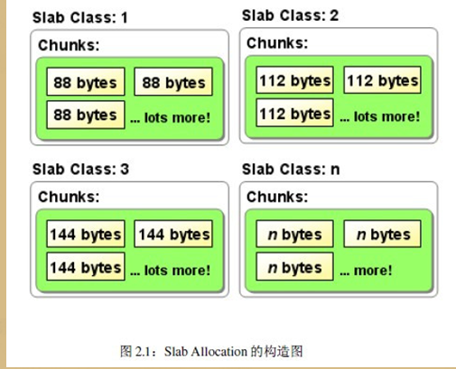

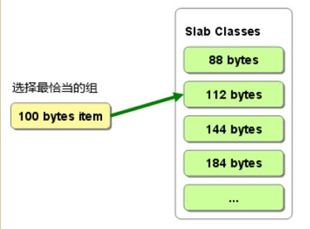

## 野指针

野指针：当所指向的对象被释放或者收回，但是对该指针没有作任何的修改，以至于该指针仍旧指向已经回收的内存地址

### 什么情况会产生野指针

- 指针变量未初始化
- 指针释放之后未置空
- 指针操作超越变量作用域：不要返回指向栈内存的指针或引用，因为栈内存在函数结束时会被释放

## 如何定义一个只能在堆上（栈上）生成对象的类？

### 只能在堆上：

做法：将析构函数设置为私有

解释：编译器在为类对象分配栈空间时，会先检查类的析构函数的访问性。如果类的析构函数是私有的，则编译器不会在栈空间上为类对象分配内存。

### 只能在栈上：

做法：将new 和 delete 重载为私有

解释：只有使用new运算符，对象才会建立在堆上，因此，只要禁用new运算符就可以实现类对象只能建立在栈上。


## 栈和堆的区别

- 申请方式
  - 栈: 由系统自动分配
  - 堆: 需要程序员自己申请，并指定大小
- 申请后系统的响应
  - 栈：只要栈的剩余空间大于所申请空间，系统将为程序提供内存，否则将报overflow栈溢出
  - 操作系统有一个**记录空闲内存地址的链表**，当系统收到程序的申请时，会遍历该链表，寻找第一个空间大于所申请空间的堆节点，然后将该节点从空闲结点链表中删除，并将该结点的空间分配给程序；另外，对于大多数系统，会在这块内存空间中的首地址处记录本次分配的大小，这样，代码中的 delete 语句才能正确的释放本内存空间；另外，由于找到的堆结点的大小不一定正好等于申请的大小，系统会自动的将多余的那部分重新放入空闲链表中 
- 申请大小的限制
  - 栈：在 Windows 下 , 栈是向低地址扩展的数据结构，是一块连续的内存的区域。这句话的意思是栈顶的地址和栈的最大容量是系统预先规定好的，如果申请的空间超过栈的剩余空间时，将提示 overflow 。因此，能从栈获得的空间较小
  - 堆：堆是向高地址扩展的数据结构，是不连续的内存区域。而链表的遍历方向是由低地址向高地址。堆的大小受限于计算机系统中有效的虚拟内存。由此可见，堆获得的空间比较灵活，也比较大
- 申请效率的比较
  - 栈由系统自动分配，速度较快。但程序员是无法控制的
  - 堆是由 new 分配的内存，一般速度比较慢，而且容易产生内存碎片 , 不过用起来最方便 
- 堆和栈中的存储内容
  - 栈： 在函数调用时，存放返回地址、函数参数、局部变量。注意静态变量是不入栈的
  - 堆：一般是在堆的头部用一个字节存放堆的大小。堆中的具体内容由程序员安排
- 存取效率：栈比堆快


## 只使用栈的缺点

栈的特点是先进后出，如果先进去的元素一直不用，但后面的元素要用到，就会导致先进去的元素一直占着栈空间不能释放，导致内存的使用率不高

## 只使用堆的缺点

堆之所以能与比栈更好的动态分配的性能是因为堆往往使用了较为复杂的数据结构，这就会导致操作堆的成本要远远大于栈的成本，所以如果仅仅使用堆会使的程序整体效率变慢。

## 栈为什么要有上限

- 栈的功能主要是函数调用、为函数调用提供一些保存现场、恢复现场的操作。栈帧中主要存储的数据有函数返回地址、函数参数、局部变量。在一个程序中这些信息占用内存不大，所以一般情况下栈空间都特别小。 而且栈空间用户无法操作，是由编译器和操作系统决定的
- 栈的地址空间必须连续，如果任其任意成长，会给内存管理带来困难。对于多线程程序来说，每个线程都必须分配一个栈，因此没办法让默认值太大


## new和malloc区别

- malloc是C++/C语言的标准库函数；而new是C++语言中的操作符
- new返回指定类型的指针；malloc返回void*，需要强制类型转换
- new可以自动计算所需空间的大小；malloc由用户自己计算所需空间大小。
- 而new除了分配内存处，还会对对象做初始化。
- new分配内存失败会抛出异常，malloc返回NULL

https://blog.csdn.net/nyist_zxp/article/details/80810742

`int* p = (int *) malloc ( sizeof(int)* 100 ); //分配可以放得下100个整数的内存空间`

## new分配的内存可以通过free释放吗

不行，new和delete不光分配内存，还做了构造函数和析构函数

## new、operator new、placement new的区别

### new

不能被重载

- 它先调用operator new分配内存
- 然后调用构造函数初始化那段内存
- 返回相应指针

### operator new

- 只分配所要求的空间，不调用相关对象的构造函数。
- 当无法满足所要求分配的空间时，调用new_handler
- 可以被重载
  - 重载时，返回类型必须声明为void*
  - 重载时，第一个参数类型必须为表达要求分配空间的大小（字节），类型为size_t
  - 重载时，可以带其它参数

### placement new

operator new重载的一个版本

它并不分配内存，只是返回指向已经分配好的某段内存的一个指针。因此不能删除它，但需要调用对象的析构函数。

**placement new的作用**

允许构造一个新对象到预分配的内存上

构造对象都是在一个预先准备好了的内存缓冲区中进行，不需要查找内存，内存分配的时间是常数；而且不会出现在程序运行中途出现内存不足的异常。所以，placement new非常适合那些对时间要求比较高，长时间运行不希望被打断的应用程序。


## main函数执行前后会执行什么代码

### main函数执行前：

1. 设置栈指针
2. 初始化静态和全局变量，即data段的内容
3. 将未初始化部分的全局变量赋初值，即bss段的内容
4. 运行全局构造器，估计是C++中构造函数之类的吧
5. 将main函数的参数，argc，argv等传递给main函数，然后才真正运行main函数

### main函数执行后：

1. 全局对象的析构函数会在main函数之后执行； 
2. 可以用_onexit 注册一个函数，它会在main 之后执行; 

## 大端、小端存储

- 大端存储：数据的高字节存储在低地址中，数据的低字节存储在高地址中
  - 接收数据的程序可以优先得到数据的最高位，以便快速反应。（通信协议）
- 小端存储：数据的高字节存储在高地址中，数据的低字节存储在低地址中
  - x86结构、ARM和DSP都是小端存储
  - 计算机通常采用小端序列，是因为CPU读取内存中的数据时，是从低地址向高地址方向进行读取的

# 数据结构

## STL 容器

### 线程安全

- 多个线程读取是安全的
  - 多个线程可以读同一个容器内的数据，读时不允许写操作
- 多个线程对不同的容器写入是安全的

多线程对同一容器的读写需要加锁

- 对于容器成员函数的每一次调用都锁住该容器直到调用完成
- 在容器返回的迭代器生存期结束之前锁住容器
- 每个容器在调用算法的执行期需要锁定

### 顺序容器

- array：固定大小数组，不能添加或删除元素，快速随机访问
- vector：可变大小数组，在尾部之外的位置插入或删除元素很慢，快速随机访问
- string：与vector相似
- list：双向链表，插入删除很快，双向顺序访问
- forward_list：单向链表，插入删除很快，单向顺序访问
- deque：双端队列，头尾插入删除快，支持快速随机访问
  - deque 容器存储数据的空间是由一段一段等长的连续空间构成，用数组（数组名假设为 map）存储着各个连续空间的首地址
  - deque 容器需要在头部或尾部增加存储空间时，它会申请一段新的连续空间，同时在数组的开头或结尾添加指向该空间的指针，由此该空间就串接到了 deque 容器的头部或尾部。


### 关联容器

set、map：底层是红黑树，红黑树是自动排序的，查找、增删效率O(logn)

unordered_set、unordered_map：底层是哈希表，元素排列无序，查找O(1)，增删O(1)


当我们要使用集合来解决哈希问题的时候，优先使用unordered_set，因为它的查询和增删效率是最优的，如果需要集合是有序的，那么就用set，如果要求不仅有序还要有重复数据的话，那么就用multiset

### resize和reserve的区别

- reserve: 分配空间，更改capacity，但不改变size，为容器预留空间，但并不真正创建元素对象，在创建对象之前，不能引用容器内的元素
- resize: 分配空间，更改capacity，也改变size，并且创建对象，可以引用容器内的对象了

### vector迭代器失效的情况

- 当插入（push_back）一个元素后，end操作返回的迭代器失效
- 当进行删除操作（erase，pop_back）后，指向删除点和它后面的元素的迭代器失效

## 哈希表

利用数组的随机访问特性, 将key-value形式的数据， 其中的key转换成数组下标， 即可实现将其存放到数组中，进而实现随机访问，而其中将key转换成数字的函数, 被称为散列函数， 或哈希函数

设计一个哈希函数, 有如下三点要求：

- 散列函数计算得出的值是一个正整数(数组下标嘛)
- 若key相等, 则计算后的哈希值相等
- 若key不相等, 则计算后的哈希值不相等

**除留余数法**（常用的哈希函数）：用一个特定的质数来除所给定的关键字，所得余数即为该关键字的哈希值

**哈希冲突**（key不同，哈希值相同）

- 开放寻址法：当发生哈希冲突的情况时, 就从当前位置往后找, 找到第一个空缺的位置放入
  - 装载因子 = 表中元素个数 / 表的长度
  - 装载因子越大,，说明空位越少，冲突越多，哈希表的性能越低.

- 再哈希法：使用多个哈希函数，第一个冲突时，使用第二个哈希函数，直到不冲突为止

- 拉链法：将所有哈希值相同的关键字，都链接在同一个链表中

### 拉链法最坏的情况

jdk8中在链表长度超过 8 时从链表转换为红黑树，即在下标内的时间复杂度从单链表的O(N) 降低为红黑树的 O(logN)，而当元素个数少于 6 个时从红黑树转换为单链表。 由于数据比较少时红黑树旋转，节点存储更多的指针等消耗也比较大，性能并不高，所以数据少时使用了单链表。

### 扩容

当容器中元素增多，每个桶中的元素会增加，为了保证效率， hash_map会自动申请更大的内存，以生成更多的桶，因此在insert以后，以前的迭代器有可能是不可用的

扩容时需要满足两个条件：

- 存放新值的时候当前hash_map所有元素的个数大于等于阈值；
- 存放新值的时候发生哈希冲突。

STL会默认指定初始桶大小为16，负载因子是0.75，因此阈值就是16*0.75 = 12，所以当新插入元素时，当前的元素个数超过12，并且发生了冲突，就会扩容hash桶。扩容的大小是给之前的数组翻倍。

## 平衡二叉树（AVL树）

特点：

- 非叶子节点最多拥有两个子节点
- 非叶子节值大于左边子节点、小于右边子节点
- 树的左右两边的层级数相差不会大于1
- 没有值相等重复的节点

AVL 树是高度平衡的，频繁的插入和删除，会引起频繁的rebalance，导致效率下降；

红黑树不是高度平衡的，算是一种折中，插入最多两次旋转，删除最多三次旋转。

## 红黑树

红黑树是为了应对二叉查找树最坏的情况

- 它在每个节点增加了一个存储位表示颜色
- 红黑树可以保证最长路径不超过最短路径的二倍，因此，红黑树是一种近似平衡二叉树。相对于要求严格的AVL树来说，它的旋转次数少，所以对于搜索，插入，删除操作较多的情况下，通常使用红黑树
- 所以红黑树在查找、插入、删除的性能都是O(logn)，且性能稳定，所以STL里面很多结构包括map底层实现都是使用的红黑树

**性质：**

1. 每个结点不是黑色就是红色
2. 根是黑色
3. 如果一个节点是红色的，则它的两个孩子结点是黑色的
4. 对于每个结点，从该结点到其所有后代叶结点的路径上，均包含相同数目的黑色结点——保证了最长路径不超过最短路径的二倍


## 跳表

插入、删除、查找操作时间复杂度是 O(logn)

跳表级数h=log2n - 1，包含原始链表这一层的话，跳表的高度就是 log2n

跳表每层访问节点不超过3个节点，时间复杂度为O(3log2n) = O(log2n)


## b+树特点

- 非叶子结点只存储键、指针信息
- 数据记录都放在叶子结点中
- 叶子结点之间通过指针链接成链表


### 为什么B+树更适合操作系统的文件索引和数据库索引

- B+树的磁盘读写代价更低：非叶子节点不存储数据，节点小，相应的磁盘的I/O次数少
- B+树的查询效率更加稳定：所有关键字数据地址都存在叶子节点上，所以每次查找的次数都相同
- B+树天然具备排序功能：B+树所有的叶子节点数据构成了一个有序链表，在查询大小区间的数据时候更方便，数据紧密性很高，缓存的命中率也会比B树高
- 全表扫描更快：B+树遍历整棵树只需要遍历所有的叶子节点即可，而不需要像B树一样需要对每一层进行遍历，这有利于数据库做全表扫描
- B+树的层级更少：相较于B树B+每个非叶子节点存储的关键字数更多，树的层级更少所以查询数据更快


# 操作系统

## 程序和进程的区别

- 而程序是一组有序的指令集合，是一种静态概念；进程是程序的一次执行过程，是一种动态概念
- 程序可以长期保存；进程是是动态地创建和消亡的，具有一定的生命周期
- 一个程序也以构成多个进程；一个进程也可以执行多个程序

## 进程和线程的区别

- 进程是操作系统资源调度的基本单位，线程是任务的调度执行的基本单位

- 线程在进程下运行（单纯的车厢无法运行）

- 一个进程可以包含多个线程（一辆火车可以有多个车厢）

- 不同进程间数据很难共享（一辆火车上的乘客很难换到另外一辆火车，比如站点换乘）

  同一进程下不同线程间数据很易共享（A车厢换到B车厢很容易）

- 进程要比线程消耗更多的计算机资源（采用多列火车相比多个车厢更耗资源）

- 进程间不会相互影响，一个线程挂掉将导致整个进程挂掉（一列火车不会影响到另外一列火车，但是如果一列火车上中间的一节车厢着火了，将影响到所有车厢）

- 进程有单独的内存空间，因此切换上下文开销大


## 协程是什么

- 协程是一种用户态的轻量级线程，协程的调度完全由用户控制
- 一个线程可以多个协程，一个进程也可以单独拥有多个协程
- 线程进程都是同步机制，而协程则是异步
- 协程能保留上一次调用时的状态，每次过程重入时，就相当于进入上一次调用的状态

## 孤儿进程和僵尸进程

孤儿进程：父进程退出，而它的一个或多个子进程还在运行，那么那些子进程将成为孤儿进程。孤儿进程将被init进程(进程号为1)所收养，并由init进程对它们完成状态收集工作。

僵尸进程：一个进程使用fork创建子进程，如果子进程退出，而父进程并没有调用wait或waitpid获取子进程的状态信息，那么子进程的进程描述符仍然保存在系统中。这种进程称之为僵尸进程。

### 有什么危害

- 僵尸进程会占用系统资源，如果很多，则会严重影响服务器的性能
- 孤儿进程不会占用系统资源，最终是由init进程托管，由init进程来释放它。

## 进程的几种状态

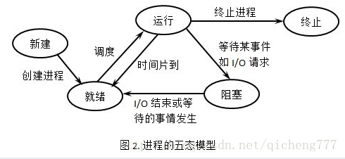

## 线程的几种状态

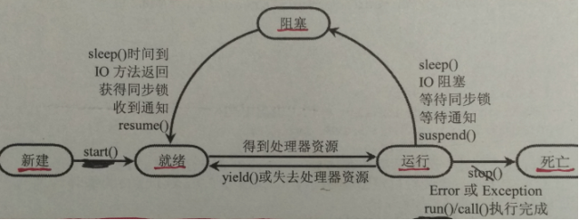

## 进程间通信的方式

- 无名管道( pipe )：半双工，只能在具有亲缘关系的进程间使用
- 有名管道 (named pipe) ：半双工，允许无亲缘关系进程间的通信。
- 高级管道(popen)：将另一个程序当做一个新的进程在当前程序进程中启动，则它算是当前程序的子进程
- 消息队列( message queue ) ：消息队列是由消息的链表，存放在内核中并由消息队列标识符标识。消息队列克服了信号传递信息少、管道只能承载无格式字节流以及缓冲区大小受限等缺点。
- 信号量( semaphore ) ： 信号量是一个计数器，可以用来控制多个进程对共享资源的访问。它常作为一种锁机制，防止某进程正在访问共享资源时，其他进程也访问该资源。
- 信号 ( signal ) ： 信号是一种比较复杂的通信方式，用于通知接收进程某个事件已经发生。
- 共享内存( shared memory ) ：共享内存就是映射一段能被其他进程所访问的内存，
- 套接字( socket ) ： 套接字也是一种进程间通信机制，与其他通信机制不同的是，它可用于不同机器间的进程通信。

### 轻量级的通信

`ZeroMQ`：

点对点无中间节点：传统的消息队列都需要一个消息服务器来存储转发消息。而`ZeroMQ`则放弃了这个模式，把侧重点放在了点对点的消息传输上，并且（试图）做到极致。以为消息服务器最终还是转化为服务器对其他节点的点对点消息传输上。`ZeroMQ`能缓存消息，但是是在发送端缓存。`ZeroMQ`里有水位设置的相关接口来控制缓存量。当然，`ZeroMQ`也支持传统的消息队列（通过`zmq_device`来实现）。

## 线程同步机制

线程同步指的是线程之间要排队，一个一个对共享资源进行操作

-  临界区（Critical Section）：在任意时刻只允许一个线程对共享资源进行访问，如果有多个线程试图访问公共资源，那么在有一个线程进入后，其他试图访问公共资源的线程将被挂起，并一直等到进入临界区的线程离开，临界区在被释放后，其他线程才可以抢占
- 互斥量（Mutex）：互斥对象和临界区很像，采用互斥对象机制，只有拥有互斥对象的线程才有访问公共资源的权限
- 信号量（Semaphore）：信号量用于限制对临界资源的访问数量，保证了消费数量不会大于生产数量。它允许多个线程在同一时刻访问同一资源，但是需要限制在同一时刻访问此资源的最大线程数目。每增加一个线程对共享资源的访问，当前**可用资源计数**就会减1 ，只要当前可用资源计数是大于0 的，就可以发出信号量信号
- 事件对象（Event）：通过通知操作的方式来保持线程的同步，还可以方便实现对多个线程的优先级比较的操作

## 进程/线程上下文切换的开销

- 切换页目录
- 切换内核态堆栈
- 切换硬件上下文（进程恢复前，必须装入寄存器的数据统称为硬件上下文）

## 进程切换与线程切换的区别

进程切换涉及到虚拟地址空间的切换，而线程切换则不会。因为每个进程都有自己的虚拟地址空间，而线程是共享所在进程的虚拟地址空间的

## 多进程和多线程的优缺点

多进程优点

- 每个进程互相独立，不影响主程序的稳定性，子进程崩溃没关系；
- 通过增加CPU，就可以容易扩充性能；

多进程缺点

- 逻辑控制复杂，需要和主程序交互；
- 需要跨进程边界，如果有大数据量传送，就不太好，适合小数据量传送、密集运算
- 多进程调度开销比较大；

多线程的优点

- 无需跨进程边界；
- 程序逻辑和控制方式简单；
- 所有线程可以直接共享内存和变量等；
- 线程消耗资源比进程少；

多线程的缺点

- 每个线程与主程序共用地址空间，受限于2GB地址空间；
- 线程之间的同步和加锁控制比较麻烦；
- 一个线程的崩溃会导致整个进程崩溃；
- 到达一定的线程数程度后，即使再增加CPU也无法提高性能，例如Windows Server 2003，大约是1500个左右的线程数就快到极限了（线程堆栈设定为1M），如果设定线程堆栈为2M，还达不到1500个线程总数；

## 守护进程

- Linux系统启动时会启动很多系统服务进程，这些进程没有控制终端，不能直接和用户交互，这种进程称为守护进程
- 守护进程独立于控制终端并周期性的执行某种任务或者等待处理某些发生的事件

## 一个线程OOM其他线程还能运行

当一个线程抛出OOM异常后，它所占据的内存资源会全部被释放掉，从而不会影响其他线程的运行

## 虚拟内存

### 虚拟内存是什么

虚拟内存是计算机系统内存管理的一种技术。它使得应用程序认为它拥有连续可用的内存，而实际上，它通常是被分隔成多个物理内存碎片，还有部分暂时存储在外部存储器上。通过虚拟内存可以让程序可以拥有超过系统物理内存大小的可用内存空间

### 虚拟内存解决了什么问题

- 给进程提供了一个更大的内存空间，不再受物理内存大小的限制，更加高效的使用主存
- 为程序提供内存管理，保护了每个进程的地址空间不被其他进程破坏
- 给每个进程提供了一致的、完整的地址空间，从而简化了存储器管理

### 虚拟内存的实现方法

- 如果一部分程序并不经常执行，那我们可以考虑只加载需要执行的部分。
- 那么们可以构造一个大的虚拟内存空间，然后将其映射到较小的物理内存。
- 这个虚拟内存空间存储我们进程的所有信息，而当进程执行时，我们只加载需要执行的部分，需要什么再加载什么
- 之后，再通过调页功能及页面置换功能陆续的把即将要运行的页面调入内存，同时把暂不运行的页面换出到外存上

## 页面置换算法

### 什么是页面置换算法

进程运行时，若其访问的页面不在内存而需将其调入，但内存已无空闲空间时，就需要从内存中调出一页程序或数据，送入磁盘的对换区，其中选择调出页面的算法就称为页面置换算法。

页面置换算法的作用：实现虚拟存储管理

### 常见的页面置换算法

- **OPT（最佳页面置换算法）** ：淘汰以后不会使用的页面。
- **FIFO（先进先出算法）** : 优先淘汰最早进入内存的页面
- **LRU（最近最少使用淘汰算法）** ：淘汰最近最少使用的页面。
- **LFU（最不经常使用淘汰算法）** : 内存内使用越频繁的页面，被保留的时间也相对越长。


## 阻塞/非阻塞和同步/异步的区分

- 阻塞/非阻塞：应用程序的调用是否立即返回
- 同步/异步：数据拷贝的时候线程是否阻塞

## Reactor和Proactor的区别

`Reactor`模式是基于同步I/O的，而`Proactor`模式是异步I/O的

- `Reactor`：来了事件操作系统通知应用进程，让应用进程来处理
- `Proactor`：来了事件操作系统来处理，处理完再通知应用进

### Proactor的好处

读写工作全程由操作系统来做，并不需要像 Reactor 那样还需要应用进程主动发起 read/write 来读写数据，操作系统完成读写工作后，就会通知应用进程直接处理数据

## 死锁

### 死锁是什么

当线程A持有独占锁a，并尝试去获取独占锁b的同时，线程B持有独占锁b，并尝试获取独占锁a的情况下，就会发生AB两个线程由于互相持有对方需要的锁，而发生的阻塞现象，我们称为死锁

### 造成死锁必须达成的4个条件

1. 互斥条件：一个资源每次只能被一个线程使用。
2. 请求与保持条件：一个线程因请求资源而阻塞时，对已获得的资源保持不放。
3. 不剥夺条件：线程已获得的资源，在未使用完之前，不能强行剥夺。
4. 循环等待条件：若干线程之间形成一种头尾相接的循环等待资源关系。


### 死锁预防

#### 1、破坏互斥条件

使资源同时访问而非互斥使用，就没有线程会阻塞在资源上，从而不发生死锁

#### 2、破坏请求与保持条件

每个线程运行前必须一次性申请它所要求的所有资源，且仅当该进程所要资源均可满足时才给予一次性分配。这种实现会使得资源的利用率很低

#### 3、破坏不剥夺条件

占有资源的线程若要申请新资源，必须主动释放已占有资源，若需要此资源，应该向系统重新申请

#### 4、破坏循环等待条件

给系统的所有资源编号，规定线程请求所需资源的顺序必须按照资源的编号依次进行。

### 死锁避免

银行家算法：实质就是要设法保证系统动态分配资源后不进入不安全状态，以避免可能产生的死锁。 即每当线程提出资源请求且系统的资源能够满足该请求时，系统将判断满足此次资源请求后系统状态是否安全，如果判断结果为安全，则给该线程分配资源，否则不分配资源，申请资源的线程将阻塞。

### 死锁解除

- 从其他进程强制剥夺资源给死锁进程
- 撤销死锁进程，撤销的原则可以按进程的优先级和撤销进程代价的高低进行

### 排查死锁

Java：`jstack `

Linux C++：`pstack` + `gdb `

## 同步锁

每个对象有一个监视器锁（monitor），当monitor被占用时就会处于锁定状态

1. 如果monitor的进入数为0，则该线程进入monitor，然后将进入数设置为1，该线程即为monitor的所有者
2. 如果线程已经占有该monitor，只是重新进入，则进入monitor的进入数加1
3. 如果其他线程已经占用了monitor，则该线程进入阻塞状态，直到monitor的进入数为0，再重新尝试获取monitor的所有权

Synchronized是通过对象内部的一个叫做监视器锁（monitor）来实现的

## 互斥锁

互斥锁：确保同一时间只有一个线程访问共享资源，先对互斥量进行加锁，如果互斥量已经上锁，调用线程会阻塞，直到互斥量被解锁。在完成了对共享资源的访问后，要对互斥量进行解锁。

## 自旋锁

没有获取到锁的线程就一直循环等待判断该资源是否已经释放锁，自旋锁避免了线程上下文切换的开销，但它会一直占着cpu

## 线程池

线程池（Thread Pool）是一种基于管理线程的工具

### 使用线程池的好处

- **降低资源消耗**：通过池化技术重复利用已创建的线程，降低创建和销毁线程造成的损耗。
- **提高响应速度**：任务到达时，无需等待线程创建即可立即执行。
- **提高线程的可管理性**：线程是稀缺资源，如果无限制创建，不仅会消耗系统资源，还会因为线程的不合理分布导致资源调度失衡，降低系统的稳定性。使用线程池可以进行统一的分配、调优和监控。
- **提供更多更强大的功能**：线程池具备可拓展性，允许开发人员向其中增加更多的功能。比如延时定时线程池`ScheduledThreadPoolExecutor`，就允许任务延期执行或定期执行。

### 线程池的工作原理


- 当线程池中有任务需要执行时
- 线程池会判断如果线程数量没有超过核心数量，就会新建线程池进行任务执行；如果线程池中的线程数量已经超过核心线程数，这时候任务就会被放入任务队列中排队等待执行；
- 如果任务队列超过最大队列数，并且线程池没有达到最大线程数，就会新建线程来执行任务；如果超过了最大线程数，就会执行拒绝执行策略。

### 线程池为什么要把任务放到队列中

因为线程若是无限制的创建，可能会导致内存占用过多而产生OOM，并且会造成`cpu`过度切换。

### 线程池为什么要使用阻塞队列

- 阻塞队列可以保证任务队列中没有任务时阻塞获取任务的线程，使得线程进入wait状态，释放`cpu`资源
- 当队列中有任务时才唤醒对应线程从队列中取出消息进行执行

### 线程复用原理

线程池将线程和任务进行解耦，线程是线程，任务是任务

在线程池中，同一个线程可以从阻塞队列中不断获取新任务来执行，其核心原理在于线程池对 Thread 进行了封装，并不是每次执行任务都会调用 `Thread.start() `来创建新线程，而是让每个线程去执行一个“循环任务”，在这个“循环任务”中不停检查是否有任务需要被执行，如果有则直接执行，也就是调用任务中的 run 方法，将 run 方法当成一个普通的方法执行，通过这种方式将只使用固定的线程就将所有任务的 run 方法串联起来。

### 线程池状态

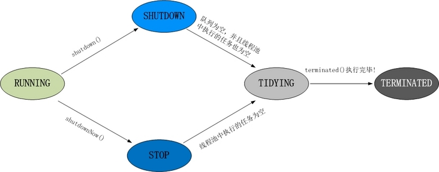

- RUNNING：线程池的初始化状态，可以添加待执行的任务
- SHUTDOWN：线程池处于待关闭状态，不接收新任务仅处理已经接收的任务
- STOP：线程池立即关闭，不接收新的任务，放弃缓存队列中的任务并且中断正在处理的任务
- TIDYING：当所有的任务已终止，任务数量为0，线程池会变为TIDYING状态
- TERMINATED：线程池终止状态

## 计算机运行程序的过程

- 代码存储在硬盘上
- 要执行代码，需要将代码读到内存中（二进制）
- CPU读内存
  - 从内存中读取数据，然后放到寄存器中
  - 把寄存器中的数据写入到内存
  - 进行数学运算和逻辑运算
  - 执行下一条指令

## 代码到可执行文件的四个过程

预处理：展开头文件

编译：将代码转成汇编代码

汇编：将汇编代码转成机器可以执行的指令

链接：将`.o`文件和库（动态库、静态库）链接到一起生成可执行`.exe`文件


## 编译和链接

- 编译：把源代码翻译成机器语言，并形成目标文件
  - 编译器只检测程序语法，函数、变量是否被声明
- 链接：把目标文件、操作系统的启动代码和库文件组织起来形成可执行程序


## 动态链接和静态链接的区别

- 静态链接方式：在程序执行前完成所有的组装工作，生成一个可执行的目标文件（EXE文件）。
- 动态链接方式：在程序执行时完成链接工作，并且在内存中一般只保留该编译单元的一份拷贝

采用动态链接库的优点：

- 更加节省内存
- DLL文件与EXE文件独立，只要输出接口不变，更换DLL文件不会对EXE文件造成任何影响，因而极大地提高了可维护性和可扩展性。

**静态库**：该LIB包含函数代码本身（即包括函数的索引，也包括实现），在编译时直接将代码加入程序当中

**动态库**：该LIB包含了函数所在的DLL文件和文件中函数位置的信息（索引），函数实现代码由运行时加载在进程空间中的DLL提供

**总之，lib是编译时用到的，dll是运行时用到的。如果要完成源代码的编译，只需要lib；如果要使动态链接的程序运行起来，只需要dll**。

## 硬链接与软链接

- 硬链接：引用同一文件系统中的文件。它引用的是文件在文件系统中的物理索引(也称为 inode)。移动或删除原始文件时，硬链接不会被破坏，因为它所引用的是文件的物理数据而不是文件在文件结构中的位置
- 软链接：也称为符号链接，新建的文件以“路径”的形式来表示另一个文件。删除原来的文件，则相应的软连接也不可用

# Linux

## 5种IO模型

阻塞IO模型、非阻塞IO模型、IO复用模型、信号驱动的IO模型、异步IO模型

## 文件权限

### 1、chmod：改变文件或目录的访问权限

chmod [who] [+ | - | =] [mode] 文件名? 

chmod 777：r=4,w=2,x=1 

第一个数字表示文件所有者的权限

第二个数字表示与文件所有者同属一个用户组的其他用户的权限

第三个数字表示 其它用户组的权限


### 2、chgrp：改变文件或目录所属的组

chgrp [选项] group filename? 

举例：改变/opt/local /book/及其子目录下的所有文件的属组为book

`chgrp - R book /opt/local /book `

### 3、chown 命令：更改某个文件或目录的属主和属组

chown [选项] 用户或组 文件 

举例：把目录/his及其下的所有文件和子目录的属主改成wang，属组改成users

`chown - R wang.users /his `

## mmap

mmap内存映射函数，使得进程之间通过映射同一个文件实现共享内存。 文件被映射到进程地址空间后，进程可以像访问内存一样对文件进行访问，不必再调用read()，write()等操作


## Linux内存管理

### 虚拟地址

#### 虚拟地址是什么

- 为了充分利用和管理系统内存资源，Linux采用虚拟内存管理技术，利用虚拟内存技术让每个进程都有`4GB` 互不干涉的虚拟地址空间
- 每个进程都有独立的虚拟地址空间，进程访问的虚拟地址并不是真正的物理地址； 
- 虚拟地址可通过每个进程上的页表(在每个进程的内核虚拟地址空间)与物理地址进行映射，获得真正物理地址； 
- 如果虚拟地址对应物理地址不在物理内存中，则产生缺页中断，真正分配物理地址，同时更新进程的页表；如果此时物理内存已耗尽，则根据内存替换算法淘汰部分页面至物理磁盘中


#### 虚拟地址的好处

- 避免用户直接访问物理内存地址，防止一些破坏性操作，保护操作系统
- 每个进程都被分配了4GB的虚拟内存，用户程序可使用比实际物理内存更大的地址空间

#### 虚拟地址空间划分

- 用户空间
- 内核空间

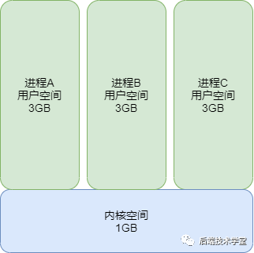

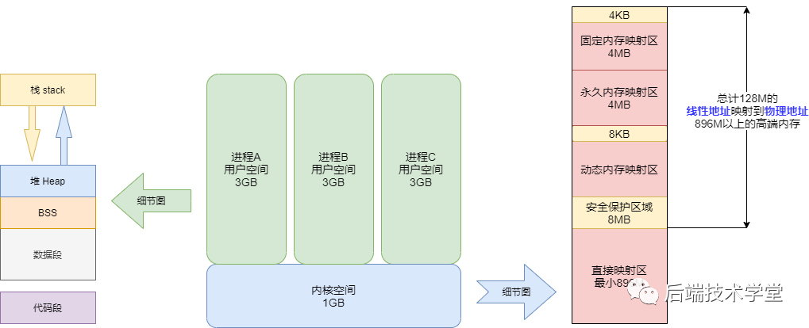

### 物理地址

#### 虚拟地址转物理地址

把虚拟地址转换成内存的物理地址，这中间涉及利用`MMU` 内存管理单元（Memory Management Unit ) 对虚拟地址分段和分页地址转换


#### 物理内存划分

ZONE_DMA：`DMA`内存区域。直接映射到内核的地址空间

ZONE_NORMAL：普通内存区域。直接映射到内核的地址空间

ZONE_HIGHMEM：高端内存区域。不进行直接映射，可以通过永久映射和临时映射进行这部分内存页的访问


**4G进程地址空间被划分两部分，内核空间和用户空间**

### 用户空间

用户进程能访问的是用户空间，每个进程都有自己独立的用户空间

用户进程通常只能访问用户空间的虚拟地址，只有在执行内陷操作或系统调用时才能访问内核空间

#### 进程与内存

进程在用户空间中被划分为五个区域

- 栈
- 堆
- `bss`段：未初始化的全局变量
- `data`段：初始化的全局变量
- 代码（`text`）段

### 内核空间

mmap：是一种内存映射文件的方法，即将一个文件映射到进程的地址空间，实现文件磁盘地址和进程虚拟地址空间中一段虚拟地址的一一对映关系。实现这样的映射关系后，进程就可以采用指针的方式读写操作这一段内存

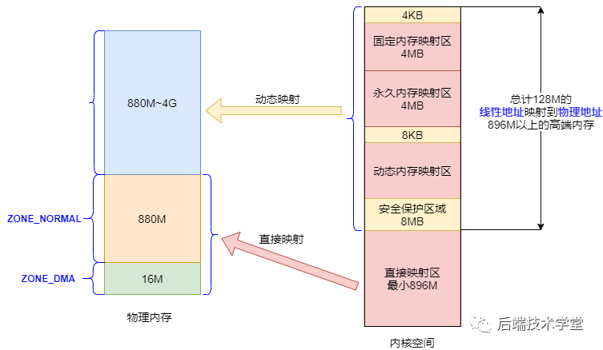

参考

http://news.eeworld.com.cn/mp/rrgeek/a88088.jspx

https://www.jianshu.com/p/fb345b94501f

### 内核态和用户态的区别

1. 用户态（User Mode）：运行用户程序
2. 内核态（Kernel Mode）：运行操作系统程序，操作硬件

- 处于用户态执行时，进程所能访问的内存空间和对象受到限制，其所处于占有的处理器是可被抢占的
- 处于内核态执行时，则能访问所有的内存空间和对象，且所占有的处理器是不允许被抢占的。

### 内核态和用户态通信

- procfs(/proc)
- netlink

## IO多路复用

### 什么是IO多路复用

让单线程或单进程可以监听多个文件描述符，一旦某个文件描述符就绪，能够通知程序进行相应的读写操作

### 1、select

#### select缺点

- 单个进程可监视的fd数量被限制，32位机默认是1024个。64位机默认是2048
- 对socket进行扫描时是线性扫描，效率低
- 每次调用select，都需要把fd集合从用户态拷贝到内核态，这个开销在fd很多时会很大

### 2、poll

和select没有区别，它将用户传入的数组拷贝到内核空间，然后查询每个fd对应的设备状态，如果设备就绪则在设备等待队列中加入一项并继续遍历，如果遍历完所有fd后没有发现就绪设备，则挂起当前进程，直到设备就绪或者主动超时，被唤醒后它又要再次遍历fd。这个过程经历了多次无谓的遍历。

#### poll缺点

- 大量的fd的数组被整体复制于用户态和内核地址空间之间，而不管这样的复制是不是有意义。          
- poll还有一个特点是“水平触发”，如果报告了fd后，没有被处理，那么下次poll时会再次报告该fd。

#### 水平触发和边缘触发

- LT模式：level trigger。当epoll_wait检测到描述符事件发生并将此事件通知应用程序，应用程序可以不立即处理该事件。下次调用epoll_wait时，会再次响应应用程序并通知此事件。
- ET模式：edge trigger。当epoll_wait检测到描述符事件发生并将此事件通知应用程序，应用程序必须立即处理该事件。如果不处理，下次调用epoll_wait时，不会再次响应应用程序并通知此事件。


### 3、epoll

#### epoll为什么要有EPOLLET触发模式？

如果采用EPOLLLT模式的话，系统中一旦有大量你不需要读写的就绪文件描述符，它们每次调用epoll_wait都会返回，这样会大大降低处理程序检索自己关心的就绪文件描述符的效率。而采用EPOLLET这种边缘触发模式的话，当被监控的文件描述符上有可读写事件发生时，epoll_wait()会通知处理程序去读写。如果这次没有把数据全部读写完(如读写缓冲区太小)，那么下次调用epoll_wait()时，它不会通知你，也就是它只会通知你一次，直到该文件描述符上出现第二次可读写事件才会通知你！！！**这种模式比水平触发效率高，系统不会充斥大量你不关心的就绪文件描述符。**

#### epoll优点

- 没有最大并发连接的限制，能打开的FD的上限远大于1024（1G的内存上能监听约10万个端口）；
- 效率提升，不是轮询的方式，不会随着FD数目的增加效率下降。只有活跃可用的FD才会调用callback函数；
  - 即epoll最大的优点就在于它只管你“活跃”的连接，而跟连接总数无关，因此在实际的网络环境中，Epoll的效率就会远远高于select和poll。
- 内存拷贝，利用mmap()文件映射内存，加速与内核空间的消息传递；即epoll使用mmap减少复制开销。

### 区别

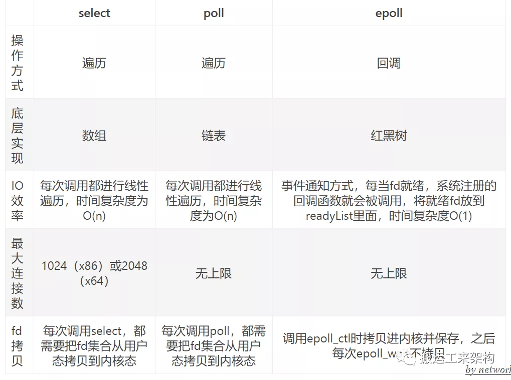

参考

https://mp.weixin.qq.com/s/GCoczkOzDA2xfp8Nzb04dw

## IOCP

用于windows系统，非阻塞异步模型

## Epoll和IOCP的区别

- Epoll 用于 Linux 系统；而 IOCP 则是用于 Windows；
- Epoll 是当事件**资源满足时**发出可处理通知消息；而 IOCP 则是**当事件完成**时发出完成通知消息。
- 从应用程序的角度来看， Epoll 本质上来讲是**同步非阻塞**的，而 IOCP 本质上来讲则是**异步非阻塞**
- Epoll保持了事件通知与IO操作之间彼此的独立性，使用更加灵活

## 常用命令

`ps`：列出系统中当前运行的进程状态

```bash
ps -eo pid,ppid,%mem,%cpu,comm --sort=-%cpu | head
```

- `ps`：命令名字
- `-e`：选择所有进程
- `-o`：自定义输出格式
- `–sort=-%cpu`：基于 CPU 使用率对输出结果排序
- `head`：显示结果的前 10 行
- `PID`：进程的 ID
- `PPID`：父进程的 ID
- `%MEM`：进程使用的 RAM 比例
- `%CPU`：进程占用的 CPU 比例
- `Command`：进程名字

列出了由进程号为<pid>的进程创建的所有线程

```bash
 ps -T -p <pid>
```


`free`：显示内存的使用情况

`top`：实时显示系统中各个进程的资源占用状况

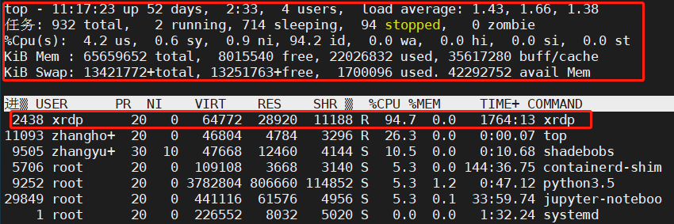

- `PID`：进程的ID
- `USER`：进程所有者
- `PR`：进程的优先级别，越小越优先被执行
- `NInice`：值
- `VIRT`：进程占用的虚拟内存
- `RES`：进程占用的物理内存
- `SHR`：进程使用的共享内存
- `S`：进程的状态。S表示休眠，R表示正在运行，Z表示僵死状态，N表示该进程优先值为负数
- `%CPU`：进程占用CPU的使用率
- `%MEM`：进程使用的物理内存和总内存的百分比
- `TIME+`：该进程启动后占用的总的CPU时间，即占用CPU使用时间的累加值。
- `COMMAND`：进程启动命令名称

定位某一个进程，观察 进程`PID` 2438的 `CPU`和内存以及负载情况

```bash
top -p 2438
```

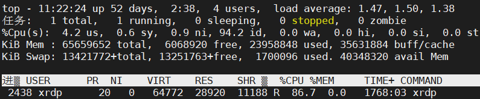

查看进程 `PID` 2438 的每一个线程占用 cpu 的情况

```bash
top -p 2438 -H
```

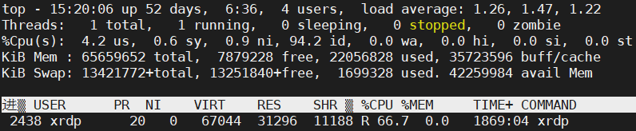


`tail`查看日志

```bash
命令格式: tail[必要参数][选择参数][文件]
-f 循环读取
-q 不显示处理信息
-v 显示详细的处理信息
-c<数目> 显示的字节数
-n<行数> 显示行数
-q, --quiet, --silent 从不输出给出文件名的首部
-s, --sleep-interval=S 与-f合用,表示在每次反复的间隔休眠S秒
```

```bash
tail  -n  10   test.log   查询日志尾部最后10行的日志;
tail  -n +10   test.log   查询10行之后的所有日志;
tail  -fn 10   test.log   循环实时查看最后1000行记录(最常用的)
```

`grep`：查找文件里符合条件的字符串

gdb调试

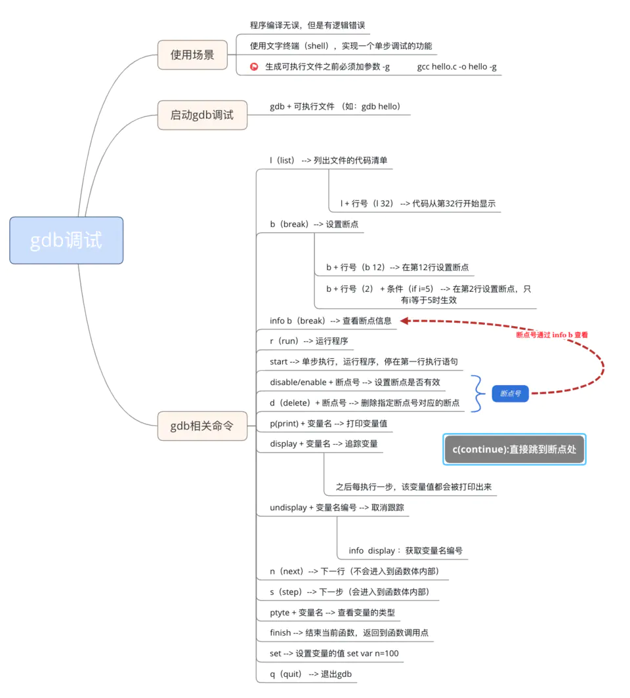

# 数据库

## MySQL执行流程


1. MySQL客户端通过协议将SQL语句发送给MySQL服务器。
2. 服务器会先检查查询缓存中是否有执行过这条SQL，如果命中缓存，则将结果返回，否则进入下一个环节（查询缓存默认不开启）
3. 服务器端进行SQL解析，预处理，然后由查询优化器生成对应的执行计划。
4. 服务器根据查询优化器给出的执行计划，再调用存储引擎的API执行查询。
5. 将结果返回给客户端，如果开启查询缓存，则会备份一份到查询缓存中


## 索引

帮助MySQL提高查询效率的一种数据结构

### 最左前缀原则

即最左优先，在检索数据时从联合索引的最左边开始匹配

MySQL引擎为了更好地利用索引，在查询过程中会动态调整查询字段顺序以利用索引


### 为什么用索引查询会变快

是因为索引使用了B+树数据结构来存储，利用二分查询的原理，有效的减少了磁盘IO的次数，所以查询会变快


### 使用索引查询一定会变快吗

- 索引需要空间来存储，也需要维护。
- B+ 树是一颗平衡树，如果对这颗树新增、修改、删除的话，会破坏它的原有结构
- 我们在做数据新增、修改、删除的时候，需要花额外的时间去维护索引
- 因为索引需要额外的存储空间和处理，那些不必要的索引反而会使查询反应时间变慢
- 所以使用索引查询不一定能提高查询性能


### 聚簇索引（InnoDB）和非聚簇索引（MyISAM）

- 聚簇索引：将数据存储与索引放到一块，索引结构的叶子结点保存了行数据
  - 主键索引一定是聚簇索引；聚簇索引不一定是主键索引
- 非聚簇索引：将数据与索引分开存储，索引结构的叶子结点指向了数据的位置

InnoDB

- 使用聚簇索引，将主键组织到B+树上，行数据存储在叶子结点

- 聚簇索引默认是主键索引

- 只有一个聚簇索引

  - 若表存在主键，则主键索引就是聚集索引。

  - 若不存在主键，则会把第一个非空的唯一索引作为聚集索引。

  - 否则，就会隐式的定义一个 rowid 作为聚集索引。


MyISAM

- 使用非聚簇索引，非聚簇索引的主键索引B+树和辅助索引B+树结构相同
- 表数据存储在独立的地方，两颗B+树的叶子结点使用同一个地址指向表数据
- 由于索引树独立，通过辅助键检索无需访问主键的索引树


#### 聚簇索引的优点

- 聚簇索引的行数据和叶子结点存储在一起，找到叶子结点立刻将数据返回访问行数据时
- 已经把页加载到buffer中，访问同一页其他行数据时，不必访问磁盘
- 辅助索引的叶子结点存储主键值，而不是数据的地址。
  - 当行数据发生变化时，主键索引的节点也需要变化，但是辅助索引存储的主键值不变，避免对辅助索引的维护工作
  - 减小辅助索引的存储空间

#### 聚簇索引的缺点

- 维护索引很昂贵，特别是插入新行或者主键被更新导致需要移动行的时候，可能面临“页分裂”的问题。页分裂会导致表占用更多的磁盘空间
- 聚集索引可能导致全表扫描变慢，尤其是行比较稀疏，或者由于页分裂导致数据存储不连续的时候


#### 为什么主键通常建议使用自增id

聚簇索引的数据的物理存放顺序与索引顺序是一致的，即：只要索引是相邻的，那么对应的数据一定也是相邻地存放在磁盘上的。如果主键不是自增id，会不断地调整数据的物理地址、分页。如果是自增的，那就简单了，它只需要一 页一页地写，索引结构相对紧凑，磁盘碎片少，效率也高。

### 什么情况下不能用索引

- 联合索引：不符合最左前缀原则
- like关键字：匹配字符串的第一个字符是"%"
- or关键字：or的前后有一个条件列不是索引


### 覆盖索引

覆盖索引不用回表

方法：将被查询（select）的字段，建立到联合索引里去

## 事务

事务：事务就是一系列操作，要么同时成功，要么同时失败

### 事务的四种隔离级别

#### 1、读未提交：一个事务可以读取另一个未提交事务的数据

脏读：看到还没提交事务时的数据

#### 2、读提交：一个事务要等另一个事务提交后才能读取数据

读提交，能解决脏读问题

不可重复读：一个事务范围内两个相同的查询却返回了不同数据

不可重复读举例：程序员拿着信用卡去享受生活（卡里当然是只有3.6万），当他埋单时（程序员事务开启），收费系统事先检测到他的卡里有3.6万，就在这个时候！！程序员的妻子要把钱全部转出充当家用，并提交。当收费系统准备扣款时，再检测卡里的金额，发现已经没钱了（第二次检测金额当然要等待妻子转出金额事务提交完）

#### 3、重复读：一个事务执行过程中看到的数据，总是跟这个事务在启动时看到的数据是一致的

就是在开始读取数据（事务开启）时，不再允许修改操作，重复读可以解决不可重复读问题

- 不可重复读对应的是修改UPDATE操作。

- 幻读对应的是插入INSERT操作

幻读举例：程序员某一天去消费，花了2千元，然后他的妻子去查看他今天的消费记录（全表扫描FTS，妻子事务开启），看到确实是花了2千元，就在这个时候，程序员花了1万买了一部电脑，即新增INSERT了一条消费记录，并提交。当妻子打印程序员的消费记录清单时（妻子事务提交），发现花了1.2万元，似乎出现了幻觉，这就是幻读

#### 4、序列化：可以解决幻读问题

Serializable 序列化：Serializable 是最高的事务隔离级别，在该级别下，**事务串行化顺序执行**，可以避免脏读、不可重复读与幻读。但是这种事务隔离级别效率低下，比较耗数据库性能，一般不使用

参考：https://www.huaweicloud.com/articles/ffc11869bfea5f6793631f9b30369be0.html

### 事务四大特性ACID

- 原子性（ Atomicity ）
- 一致性（ Consistency ）
- 隔离性（ Isolation ）
- 持久性（ Durability ）

### 2PC、3PC、TCC

2PC：两阶段提交协议，整个事务流程分为两个阶段，准备阶段（Prepare phase）、提交阶段（commit phase）

3PC：在两阶段提交的基础上**增加了CanCommit阶段**，并**引入了超时机制**。一旦事务参与者迟迟没有收到协调者的Commit请求，就会自动进行本地commit，这样相对有效地解决了协调者单点故障的问题

TCC：预处理Try、确认 Confirm、撤销Cancel。

- Try阶段：主要是对业务系统做检测及资源预留 
- Confirm阶段：确认执行业务操作 
- Cancel阶段：取消执行业务操作


## 日志

- 重做日志（redo log）：在事务执行的过程中如果发生异常（数据库崩溃），在重启MySQL服务的时候，根据Redo Log进行重做，进而恢复事务的状态。
- 回滚日志（undo log）：撤销未提交的事务
- 二进制日志（bin log）：记录了对数据库执行更改的所有操作
- 错误日志（error log）：运行过程中较为严重的警告和错误信息；服务器启动和关闭过程中的信息
- 慢查询日志（slow query log）：记录下查询超过指定时间的语句
- 通用查询日志（general log）：记录了数据库执行的所有命令
- 中继日志（relay log）：从库服务器I/O线程将主库服务器的二进制日志读取过来记录到从库服务器本地文件


## SQL查询如何优化

- 避免出现SELECT * FROM table 语句，要明确查出的字段。
- 在一个SQL语句中，如果一个where条件过滤的数据库记录越多，定位越准确，则该where条件越应该前移。
- 查询时尽可能使用索引覆盖。即对SELECT的字段建立复合索引，这样查询时只进行索引扫描，不读取数据块。
- 在判断有无符合条件的记录时建议不要用SELECT COUNT （*）和select top 1 语句。
- 应绝对避免在order by子句中使用表达式。
- 应尽量避免在 where 子句中使用!=或<>操作符，否则将引擎放弃使用索引而进行全表扫描。
- 对查询进行优化，应尽量避免全表扫描，首先应考虑在 where 及 order by 涉及的列上建立索引。
- 应尽量避免在 where 子句中对字段进行 null 值判断，否则将导致引擎放弃使用索引而进行全表扫描，如：
  `select id from t where num is null`
  可以在num上设置默认值0，确保表中num列没有null值，然后这样查询：
  `select id from t where num=0`
- 应尽量避免在 where 子句中使用 or 来连接条件，否则将导致引擎放弃使用索引而进行全表扫描，如：
  `select id from t where num=10 or num=20`
  可以这样查询：
  `select id from t where num=10 union all select id from t where num=20`
- 下面的查询也将导致全表扫描：(不能前置百分号)
  `select id from t where name like ‘%abc%’`
  若要提高效率，可以考虑全文检索。

## 左、右、内连接

- left join （左连接）：返回包括左表中的所有记录和右表中连接字段相等的记录。
- right join （右连接）：返回包括右表中的所有记录和左表中连接字段相等的记录。
- inner join （内连接）：只返回两个表中连接字段相等的行。

## where和having的区别

- where 子句是对查询结果进行分组前过滤数据，条件中不能包含聚和函数
- having 子句的作用是筛选满足条件的组，即在分组之后过滤数据，条件中经常包含聚合函数

## 数据库建表需要注意什么

- 字符集：选择`utf-8`

- 数据库名、表名建议小写，以`t `开头，单词之间可以试用`_`隔开

- 数据库引擎使用：`InnoDB`（支持事务）

- 主键使用自增id

- 经常作为 where 条件的字段最好添加索引


# 计网

## OSI七层协议


物理层：以二进制形式在物理媒介上传输数据

数据链路层：提供介质访问和链路管理

网络层：为数据包选择路由（`IP，ICMP`协议）

传输层：提供可靠的端到端的接口（TCP、UDP）

会话层：组织和协调两个会话进程之间的通信

表示层：处理用户信息的表示问题，如编码、数据格式转换和加密解密

应用层：为用户提供常用的应用程序（HTTP）

- TPC/IP协议是传输层协议，主要解决数据如何在网络中传输
- HTTP是应用层协议，主要解决如何包装数据
- Socket不属于协议范畴，而是一个调用接口（API），是对TCP/IP协议的封装

### 为什么要分层

- 易于实现和标准化各层独立，就可以把大问题分割成多个小问题，利于实现

- 灵活性好：如果某一层发生变化，只要接口不变，不会影响其他层
- 分层后，用户只关心用到的应用层，其他层用户可以复用
- 各层之间相互独立：高层不需要知道底层的功能是怎么实现的，只需要知道通过底层的接口来获得所需要的服务

## TCP、UDP的区别

- TCP 是面向连接的，UDP 是面向无连接的

- TCP 是面向字节流的，UDP 是基于数据报的

- UDP 程序结构较简单

- TCP 是可靠的，UDP不可靠

  - 保证数据正确性，UDP 可能丢包

  - TCP 保证数据顺序，UDP 不保证

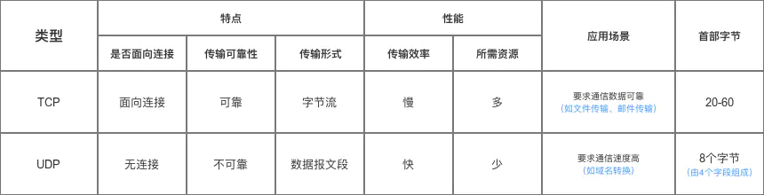


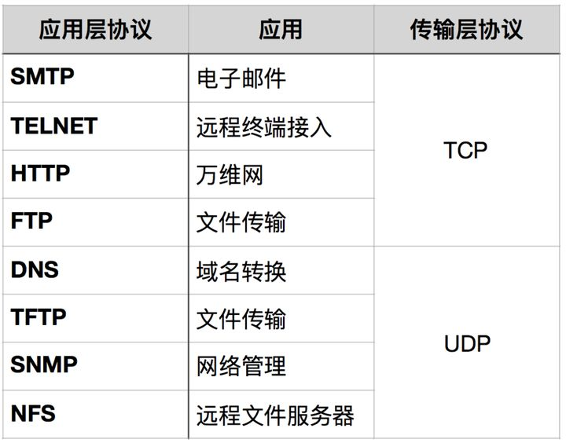


## TCP为什么可靠

- 确认和重传：接收方收到报文就会确认，发送方发送一段时间后没有收到确认就重传。 
- 数据校验 
- 数据合理分片和排序： 
- 流量控制：当接收方来不及处理发送方的数据，能降低发送方的发送速度，防止包丢失。 
- 拥塞控制：当网络拥塞时，减少数据的发送。


## UDP如何实现可靠传输

传输层UDP已经是不可靠的连接，那就要在应用层自己实现一些保障可靠传输的机制

- 超时重传（定时器）
- 有序接收 （添加包序号）
- 应答确认 （seq/ack应答机制）
- 滑动窗口流量控制等机制 （滑动窗口协议）

## UDP为什么比TCP要更快

UDP没有流量控制、拥塞控制、没有握手、没有成功确认，一个数据包发过去就不管。TCP开销大一点

## 拥塞控制的算法

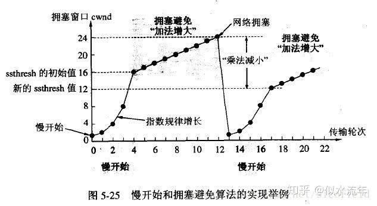

- 慢开始：不要一开始就发送大量的数据，先探测一下网络的拥塞程度，由小到大逐渐增加拥塞窗口的大小
- 拥塞避免：让拥塞窗口按线性规律缓慢增长
- 快重传：接收方在收到一个失序的报文段后就立即发出重复确认
- 快恢复：当发送方连续收到三个重复确认时，就执行“乘法减小”算法，把`ssthresh`门限减半（为了预防网络发生拥塞）

### 乘法减小和加法增大

- “乘法减小”：无论是在慢开始阶段还是在拥塞避免阶段，只要发送方判断网络出现拥塞，就把慢开始门限`ssthresh`设置为出现拥塞时的发送窗口大小的一半，并执行慢开始算法

- “加法增大”是指执行拥塞避免算法后，使拥塞窗口缓慢增大，以防止过早出现拥塞

## 拥塞控制和流量控制的区别

- 拥塞控制：拥塞控制是作用于网络的，它是防止过多的数据注入到网络中，避免出现网络负载过大的情况；

  常用的方法就是：（ 1 ）慢开始、拥塞避免（ 2 ）快重传、快恢复。

- 流量控制：流量控制是作用于接收者的，它是控制发送者的发送速度从而使接收者来得及接收，防止分组丢失的。

## 拥塞窗口和滑动窗口的区别

- 拥塞窗口：是作用于网络的，它是防止过多的数据注入到网络中，避免出现网络负载过大的情况
- 滑动窗口：接收数据端使用的窗口大小，用来告知发送端接收端的缓存大小，以此可以控制发送端发送数据的大小，从而达到流量控制的目的

## 粘包和拆包

粘包：发送的多个报文被合并成一个大的报文进行传输

拆包：一个数据包拆成多个

### 粘包拆包解决方法

- 发送端给每个数据包添加包首部，首部中应该至少包含数据包的长度，这样接收端在接收到数据后，通过读取包首部的长度字段，便知道每一个数据包的实际长度了
- 发送端将每个数据包封装为固定长度（不够的可以通过补0填充），这样接收端每次从接收缓冲区中读取固定长度的数据就自然而然的把每个数据包拆分开来
- 可以在数据包之间设置边界，如添加特殊符号，这样，接收端通过这个边界就可以将不同的数据包拆分开

## 三次握手


- A向B发出请求报文段，首部中的同步位SYN=1，初始序号seq=x
- B收到连接请求报文段后，向A发送确认，在确认报文段中把SYN位和ACK位都置1，确认号ack=x+1,也选择一个初始序号seq=y
- A收到B的报文后，还要给B发出确认。确认报文段的ACK置1，确认号ack=y+1，序号seq=x+1


ACK：确认ACK，只有ACK=1，确认号字段才有效

ack：确认序列号，期望收到对方下一个报文段的第一个数据字节的序号


### 为什么要三次握手

为了防止已失效的连接请求报文段又传送到了B。这样子B会认为是A新的连接请求，如果没有三次握手，那么连接就建立了，但是A并没有发出连接请求，也不发送数据，B的资源就浪费了。


### TCP连接”三次握手“的异常情况

- 客户端第一个【SYN】包丢了：客户端会进行三次重传【SYN】包
- 服务器端收到【SYN】回复，但是回复的【SYN，ACK】包丢了：客户端会进行如上的重传；服务器端也会进行重传
- 客户端收到【SYN，ACK】包，在回复时丢失【ACK】包：客户端会进入 ESTABLISHED状态，向服务器端发送数据；服务器端虽然没有接收到客户端最后发来【ACK】包，但是因为数据包携带ACK的确认序号，所以在接收到数据包时，会认为连接已经建立，变为ESTABLISHED状态

### 如果接收缓冲区满了，发送端怎么操作

- 接收方只要收到了包，就会发ACK包
- TCP在发送ACK包的同时会带有window大小值，表示这边能接受的数据量。发送方会根据这个调整数据量
- 接收方缓冲区满时，回给发送方的window值就是0
- 发送方看到window为0的包，会启动一个定时器，隔一段时间发一个包试探
- 一旦接收方缓冲区有足够空间了，就会给window赋上非0值。发送方就又开始发送了


## 四次挥手


- A向B发送FIN=1（1代表请求断开连接），seq=u，发送后，A进入FIN-WAIT-1 终止等待1状态。
- 当B收到A的请求后，回复ACK=1（确认收到），seq=v，ack=u+1，当B发送后，进入CLOSE-WAIT关闭等待状态
- A收到B的回复后，进入FIN-WAIT-2终止等待2状态，因为B仅仅是回复了，我收到你的断开请求了，但是B没说是否同意断开，所以A继续等待。
- 服务器B再次发送FIN=1（发送中断请求，即同意中断），ACK=1（确认收到），seq=w，B重复上次发送过的确认号ack=u+1，当B发送后进入LAST-ACK最后确认状态。
- 当A收到B的中断请求后，发送回复，ACK=1（确认收到），seq=u+1，ack=w+1，发送完后A进入TIME-WAIT时间等待状态，因为网络中可能还有数据在传输，所以A要等待一段时间，确认这些数据发送成功

- 当B收到A的确认后，进入CLOSED关闭状态，断开与A连接


### 为什么要四次挥手

TCP连接时是同步的，但结束时是不同步的，当挥手第二次后宣告了主动关闭方不会再主动发送数据，但仍然可以接收数据，此时处于半关闭状态。这样被动关闭方有足够的时间去处理以前没有处理完的数据，它可能还有一部分数据没发送出去需要处理，在此之后提出主动关闭连接。**所以4次挥手的设计为连接双方都提供了一定的处理扫尾工作的时间**

### 为什么A在TIME-WAIT状态要等2MSL（最长报文段寿命）

- 保证A发送的最后一个ACK报文段能到达B
- 让本次连接中的所有网络包都消失（等一段时间），防止“本次连接请求报文段”出现在下一次连接中

### 大量TIME-WAIT的危害和解决方法

### 危害

服务器维护每一个连接需要一个socket，也就是每个连接会占用一个文件描述符，而文件描述符的使用是有上限的，如果持续高并发，会导致一些连接失败。

### 解决方法：端口重用

设置套接字选项为SO_REUSEADDR，告诉操作系统，如果端口忙，但占用该端口TCP连接处于TIME_WAIT状态，并且套接字选项为SO_REUSEADDR，则该端口可被重用。如果TCP连接处于其他状态，依然返回端口被占用。该选项对服务程序重启非常有用。

参考：

https://www.huaweicloud.com/articles/8eb01316cf196d1d01905efbb029ee13.html


## HTTP协议

- HTTP 协议构建于 TCP/IP 协议之上，是一个应用层协议，默认端口号是 80
- HTTP 是无连接无状态的
- http请求由三部分组成：请求行、消息报头、请求正文
- 常用的HTTP方法：
  - GET： 向服务器请求资源，可以通过URL传参给服务器
  - POST：用于传输信息给服务器，主要功能与GET方法类似，但一般推荐使用POST方式
  - PUT： 传输文件，报文主体中包含文件内容，保存到对应URI位置
  - HEAD： 获得报文首部，与GET方法类似，只是不返回报文主体，一般用于验证URI是否有效
  - DELETE：删除文件，与PUT方法相反，删除对应URI位置的文件
  - OPTIONS：查询相应URI支持的HTTP方法

## GET方法与POST方法的区别

- get是不安全的，因为URL是可见的，可能会泄露私密信息，如密码等
- get重点在从服务器上获取资源，post重点在向服务器发送数据
- get传输数据是通过URL请求；post传输数据通过http的post机制，将字段与对应值封存在请求实体中发送给服务器，这个过程对用户是不可见的
- get传输的数据量小，因为受URL长度限制，但效率较高；post可以传输大量数据，所以上传文件时只能用post方式
- get方式只能支持ASCII字符，向服务器传的中文字符可能会乱码；post支持标准字符集，可以正确传递中文字符

## HTTP的缺点与HTTPS

- 通信使用明文不加密，内容可能被窃听
- 不验证通信方身份，可能遭到伪装
- 无法验证报文完整性，可能被篡改

HTTPS就是HTTP加上SSL加密 + 认证 + 完整性保护

SSL采用的非对称加密

### 对称加密（共享密钥加密）

加密和解密使用相同的密钥，在通信时还需将传输密钥给对方用来解密，密钥传输过程中同样可能被截获

### 非对称加密（公开密钥加密）

发送密文的一方要使用对方的公开密钥进行加密，对方收到信息之后，使用自己的私有密钥进行解密，这种方式不需要传输用来解密的私钥了，也就不必担心私钥被截获

## HTTPS加密过程

1. 客户端请求服务器获取`证书公钥`
2. 客户端(SSL/TLS)解析证书（无效会弹出警告）
3. 生成随机值
4. 用`公钥`加密随机值生成`密钥`
5. 客户端将`密钥`发送给服务器
6. 服务端用`私钥`解密`密钥`得到随机值
7. 将信息和随机值混合在一起进行对称加密
8. 将加密的内容发送给客户端
9. 客户端用`密钥`解密信息

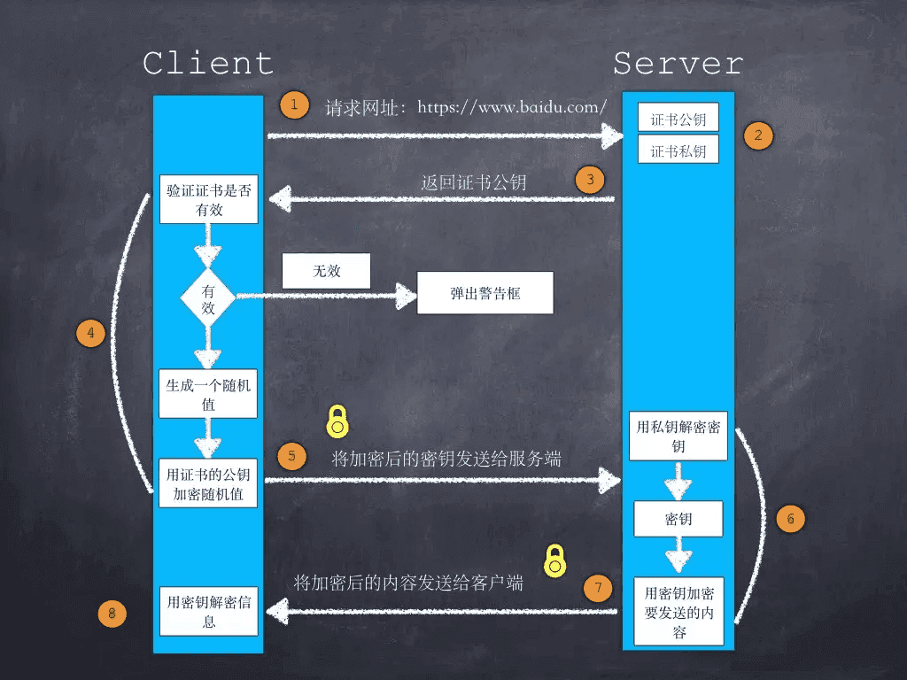

## MD5加密

MD5是哈希算法的一种，可以将任意数据产生出一个128位（16字节）的散列值，用于确保信息传输完整一致，它是不可逆的，不可以解密

MD5应用：

- 我们常在注册登录模块使用MD5，用户密码经过MD5加密后存入数据库。
- 这样用户在登录的时候，密码经过MD5加密后再与数据库中存储的数据对比，如果相同，则验证成功！
- 避免有人直接入侵数据库，获取用户密码信息！

## Base64

是什么：用文本表示二进制的编码方式，它使用4个字节的文本来表示3个字节的原始二进制数据

作用：常用于网络传输，在一些基于文本的协议中，如果需要传输图片或者文件等，我们知道图片的存储格式是二进制数据，而非文本格式，我们必须将二进制的数据编码成文本格式

Base64编码之后往往比原始数据要大，所以它并没有压缩数据

## http1.0、1.1、2.0区别

- HTTP 1.0
  - 只保持短暂的连接，连接无法复用
- HTTP 1.1
  - 默认支持长连接
  - 在同一个TCP连接里面，客户端可以同时发送多个请求
  - 新增了一些请求方法（put，delete，options）
  - 新增了一些请求头和响应头（host）
- HTTP 2.0
  - 多路复用：客户端和浏览器都可以同时发送多个请求或回应，不用按照顺序一一对应，避免了”队头堵塞
  - 二进制分帧：采用二进制格式传输数据，而非 `HTTP 1.x`的文本格式，解析起来更高效
  - 首部压缩：在客户端和服务器端使用“首部表”来跟踪和存储之前发送的键值对，只需要发送差异数据
  - 服务器推送：允许服务端推送资源给客户端，适合加载静态资源

## http 状态码

- 200 请求被成功处理
- 301 永久性重定向
- 302 临时性重定向
- 403 没有访问权限
- 404 没有对应资源
- 500 服务器错误
- 503 服务器停机或正在维护

## WebSocket

websocket是HTML5的一种新协议，允许服务器向客户端传递信息，实现浏览器和客户端双工通信

## HTTP和WebSocket的相同与不同

相同：

- 都是一样基于TCP的，都是可靠性传输协议
- 都是应用层协议

不同

 - WebSocket是双向通信协议，模拟Socket协议，可以双向发送或接受信息；HTTP是单向的。
 - WebSocket是需要浏览器和服务器握手进行建立连接的；而http是浏览器发起向服务器的连接，服务器预先并不知道这个连接。
 - http协议是短链接；websocket是长连接

联系

WebSocket在建立握手时，数据是通过HTTP传输的。但是建立之后，在真正传输时候是不需要HTTP协议的。

## IP地址和MAC地址

IP地址：为每一个网络和每一台主机分配的一个逻辑地址，是因特网上唯一标明主机的地址

MAC地址：网卡物理地址

### 区别：

IP地址基于逻辑，比较灵活，不受硬件限制，也容易记忆；MAC地址在一定程度上与硬件一致，基于物理，能够标识具体


## ARP协议

ARP：地址解析协议，通过目标设备的IP地址，查询目标设备的MAC地址，以保证通信的顺利进行

## 输入URL到地址栏

1. 解析URL
2. DNS解析：通过域名查找 IP 地址
3. TCP连接
4. 发送HTTP请求
5. 服务器处理请求并返回HTTP报文
6. 浏览器解析渲染页面
7. 断开连接

## IPv4和IPv6的区别

- 地址空间不同，IPv4中规定IP地址长度为32，而IPv6中IP地址的长度为128。
- 路由表大小不同，IPv6的路由表相比IPv4的更小。
- IPv6的组播支持以及对流的支持要强于IPv4。
- 安全性不同，IPv6的安全性更高，在使用IPv6的网络时，用户可对网络层的数据进行加密。
- 协议扩充不同，IPv6允许协议进行扩充而IPv4不允许。

## DNS（域名）解析过程

浏览器缓存->本地host缓存->本地DNS服务器->根域名服务器->顶级域名服务器->权威域名服务器，浏览器到本地DNS服务器之间递归查询，本地DNS服务器到根域名、顶级域名、权威域名服务器之间迭代查询

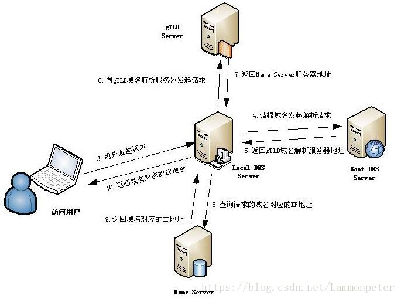

1. 检查浏览器缓存中是否缓存过该域名对应的IP地址
2. 如果在浏览器缓存中没有找到IP，那么将继续查找本机系统是否缓存过IP
3. 向本地域名解析服务系统发起域名解析的请求
4. 向根域名解析服务器发起域名解析请求
5. 根域名服务器返回gTLD域名解析服务器地址（Generic top-level domain，gTLD）
   - 常见的通用顶级域有`.com`、`.cn`、`.org`、`.edu`
6. 本地域名解析服务器向gTLD服务器发起请求
7. gTLD服务器接收请求并返回Name Server服务器
   - `Name Server`服务器就是注册的域名服务器，那么注册的域名服务商的服务器将承担起域名解析的任务
8. Name Server服务器返回IP地址给本地域名服务器
   - 将`IP`地址连同`TTL`值返回给本地域名服务器
9. 本地域名服务器缓存解析结果
   - 缓存时间由`TTL`时间来控制
10. 返回解析结果给用户，用户系统缓存该地址
    - 缓存时间由`TTL`来控制

## DNS劫持

DNS劫持又称域名劫持，是指在劫持的网络范围内拦截域名解析的请求，分析请求的域名，把审查范围以外的请求放行，否则返回假的IP地址或者什么都不做使请求失去响应，其效果就是对特定的网络不能访问或访问的是假网址。其实本质就是对DNS解析服务器做手脚，或者是使用伪造的DNS解析服务器可以通过下图来展示

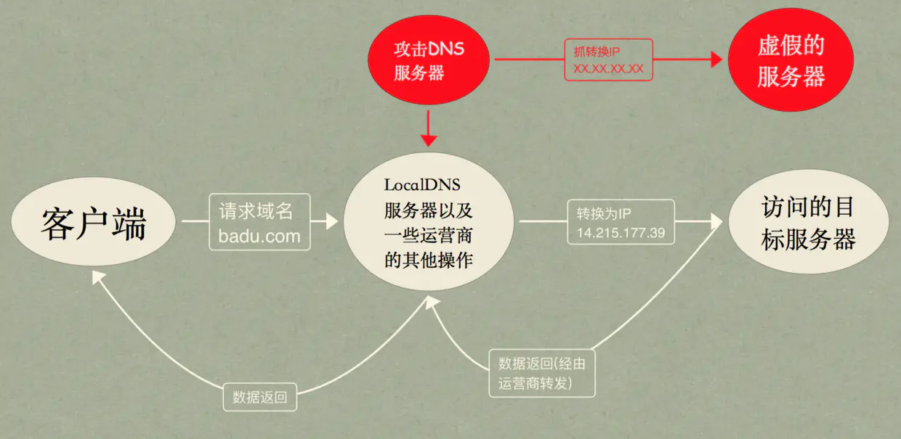

## 为什么要用域名访问服务器，直接用IP不行吗

同一个服务器节点上面可能运行多个服务器程序，如果单用IP没法进行区分，用域名可以进行区分

`ip`地址可能对应着多个web站点，单单依靠`ip`地址是不知道如何匹配到哪个web站点的。但是通过域名，我们就能够知道具体要访问哪一个HOST

## 路由器

 路由器（Router）是一种负责寻径的网络设备，它在互连网络中从多条路径中寻找通讯量最少的一条网络路径提供给用户通信。用户提供最佳的通信路径，路由器利用路由表为数据传输选择路径

## 交换机和路由器的区别

- 路由器可以给你的局域网自动分配IP，虚拟拨号，可以把一个IP分配给很多个主机使用，路由器工作在网络层
- 交换机可以把很多主机连起来，这些主机对外各有各的IP

## ICMP协议

`ICMP`（Internet Control Messages Protocol）：因特网控制消息协议

用于在IP主机、路由器之间传递控制消息。控制消息是指网络通不通、主机是否可达、路由是否可用

# 网络编程

socket流程


服务器端先初始化Socket，然后与端口绑定(bind)，对端口进行监听(listen)，调用accept阻塞，等待客户端连接。在这时如果有个客户端初始化一个Socket，然后连接服务器(connect)，如果连接成功，这时客户端与服务器端的连接就建立了。客户端发送数据请求，服务器端接收请求并处理请求，然后把回应数据发送给客户端，客户端读取数据，最后关闭连接，一次交互结束.

## socket缓冲区

每一个socket在被创建之后，系统都会给它分配两个缓冲区，即输入缓冲区和输出缓冲区

- `send`函数并不是直接将数据传输到网络中，而是负责将数据写入输出缓冲区，数据从输出缓冲区发送到目标主机是由TCP协议完成的。数据写入到输出缓冲区之后，`send`函数就可以返回了，数据是否发送出去，是否发送成功，何时到达目标主机，都不由它负责了，而是由协议负责。
- `recv`函数也是一样的，它并不是直接从网络中获取数据，而是从输入缓冲区中读取数据。

输入输出缓冲区，系统会为每个socket都单独分配，并且是在socket创建的时候自动生成的。一般来说，默认的输入输出缓冲区大小为8K。套接字关闭的时候，输出缓冲区的数据不会丢失，会由协议发送到另一方；而输入缓冲区的数据则会丢失。

## socket数据发送与接收是独立的

数据的发送和接收是独立的，并不是发送方执行一次`send`，接收方就执行以此`recv`。`recv`函数不管发送几次，都会从输入缓冲区尽可能多的获取数据。如果发送方发送了多次信息，接收方没来得及进行`recv`，则数据堆积在输入缓冲区中，取数据的时候会都取出来。换句话说，`recv`并不能判断数据包的结束位置。

## send和recv的过程

### send函数： 

- 在数据进行发送的时候，需要先检查输出缓冲区的可用空间大小，如果可用空间大小小于要发送的数据长度，则send会被阻塞，直到缓冲区中的数据被发送到目标主机，有了足够的空间之后，send函数才会将数据写入输出缓冲区。
- TCP协议正在将数据发送到网络上的时候，输出缓冲区会被锁定（生产者消费者问题），不允许写入，send函数会被阻塞，直到数据发送完，输出缓冲区解锁，此时send才能将数据写入到输出缓冲区。
- 要写入的数据大于输出缓冲区的最大长度的时候，要分多次写入，直到所有数据都被写到缓冲区之后，send函数才会返回。

### recv函数： 

函数先检查输入缓冲区，如果输入缓冲区中有数据，读取出缓冲区中的数据，否则的话，`recv`函数会被阻塞，等待网络上传来数据。如果读取的数据长度小于输出缓冲区中的数据长度，没法一次性将所有数据读出来，需要多次执行`recv`函数，才能将数据读取完毕。

## send和recv在阻塞和非阻塞时的区别

- `send`
  - 对于阻塞模式的socket，send函数将不返回直到系统缓冲区有足够的空间把你要发送的数据Copy过去以后才返回
  - 而对于非阻塞的socket，send会立即返回WSAEWOULDDBLOCK告诉调用者说:"发送操作被阻塞了!!!你想办法处理吧..." 
- `recv`
  - 对于阻塞模式的socket来说如果TCP/IP协议栈的接收缓冲区没有通知一个结果给它，它就一直不返回，耗费着系统资源
  - 对于非阻塞模式的socket该函数会马上返回,然后告诉你:WSAEWOULDDBLOCK---"现在没有数据,回头在来看看"

## TLV协议

TLV ：一个简单的自定义通信协议，是对数据包的构造和解析；TLV编码就是指对Type、Length和Value进行编码，形成比特流；解码是编码的逆过程，是从比特流缓冲区中解析还原出原始数据

Type：要封装的数据的类型域

Length：封装的总的数据长度

Value：要装入数据的值

---

数据装包示意：

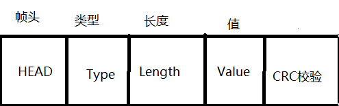

# 排序

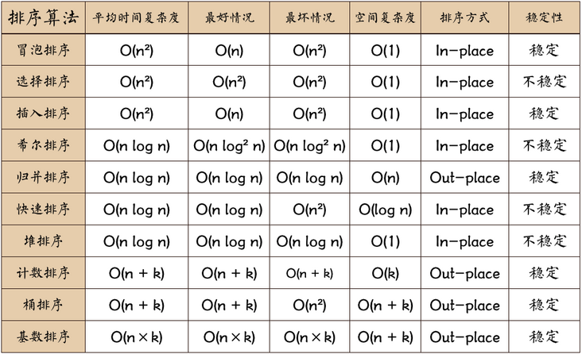

## 快排为什么用的比较多

- 快排应该是最佳的通用排序算法！
- 快排代码紧凑，常数因子小，局部性良好（让元素尽快的移动到最终的位置，然后做小范围的跳动）
- 归并需要额外空间大，稳定！
- 堆排局部性差导致缓存命中率低！：堆排序让数据过于大距离的移动

## 快速排序

```c++
void quickSort(vector<int>& arr, int l, int r) {
    // 子数组长度为 1 时终止递归
    if (l >= r) return;
    // 哨兵划分操作（以 arr[l] 作为基准数）
    int pivot=arr[l];
    int i = l, j = r;
    while (i < j) {
        while (i < j && arr[j] >= pivot) j--;
        while (i < j && arr[i] <= pivot) i++;
        swap(arr[i], arr[j]);
    }
    swap(arr[i], arr[l]);
    // 递归左（右）子数组执行哨兵划分
    quickSort(arr, l, i - 1);
    quickSort(arr, i + 1, r);
}
```


## 归并排序

```c++
void mergeSortCore(vector<int>& a, vector<int> b, int l, int r)
{
	if (l >= r)
		return;
	// 继续拆分子数组
	int mid = (l + r) >> 1;
	int l1 = l, r1 = mid;
	int l2 = mid + 1, r2 = r;
	mergeSortCore(a, b, l, mid);
	mergeSortCore(a, b, mid+1, r);

	// 合并子数组
	int k = l;
	while (l1 <= mid && l2 <= r2)
	{
		b[k++] = a[l1] < a[l2] ? a[l1++] : a[l2++];
	}
	// 把剩下的元素补齐
	while (l1 <= r1)
		b[k++] = a[l1++];
	while (l2 <= r2)
		b[k++] = a[l2++];
	// 更新原始数组
	for (k = l; k <= r; k++)
		a[k] = b[k];
}

void mergeSort(vector<int>& a) {
	int n = a.size();
	vector<int> b(n);
	mergeSortCore(a, b, 0, n - 1);
}
```

## 堆排序

思路

- 建立大根堆
- 交换堆顶与堆尾元素（堆尾元素为最大元素）
- 重新调整成大根堆

```c++
// 递归方式构建大根堆(len是arr的长度，index是第一个非叶子节点的下标)
void adjust(vector<int> &arr, int len, int index)
{
	int left = 2 * index + 1; // index的左子节点
	int right = 2 * index + 2;// index的右子节点

	int maxIdx = index; //// maxIdx是3个数中最大数的下标
	if (left<len && arr[left] > arr[maxIdx])     maxIdx = left;
	if (right<len && arr[right] > arr[maxIdx])     maxIdx = right;

	if (maxIdx != index)
	{
		swap(arr[maxIdx], arr[index]);
		adjust(arr, len, maxIdx);
	}
}

// 堆排序
void heapSort(vector<int> &arr, int size)
{
	// 构建大根堆（从最后一个非叶子节点向上）
	for (int i = size / 2 - 1; i >= 0; i--)
	{
		adjust(arr, size, i);
	}

	// 调整大根堆
	for (int i = size - 1; i >= 1; i--)
	{
		swap(arr[0], arr[i]);           // 将当前最大的放置到数组末尾
		adjust(arr, i, 0);              // 将未完成排序的部分继续进行堆排序
	}
}
```

参考：

https://www.cnblogs.com/wanglei5205/p/8733524.html

## 冒泡排序

```c++
void bubbleSort(int a[], int len)
{
	for (int i = 0; i < len - 1;i++)
	{
		for (int j = 0; j < len - i - 1;j++)
		{
			if (a[j] > a[j + 1])
			{
				int temp = a[j];
				a[j] = a[j + 1];
				a[j + 1] = temp;
			}
		}
	}
}
```

## 选择排序

```c++
void selectSort(int a[], int len) {
	for (int i = 0; i < len - 1; i++) {
		int min = i;
		for (int j = i + 1; j < len; j++) {
			if (a[min] > a[j]) {
				min = j;
			}
		}
		int tmp = a[i];
		a[i] = a[min];
		a[min] = tmp;
	}
}
```

## 插入排序

```c++
void InsertSort(vector<int>& a, int len) {
	for (int i = 1; i < len; i++)
	{
		int key = a[i];
		int j = i - 1;
		while (j>=0 && key<a[j])
		{
			a[j + 1] = a[j];
			j--;
		}
		a[j + 1] = key;
	}
}
```


# 并发

## 并发与并行

- 并发：单个CPU的操作系统在进行多线程操作时，将CPU运行时间划分成若干个时间段，再将时间段分配给各个线程执行，在一个时间段内只运行一个线程，其他线程处于挂起状态。
- 并行：对于多CPU系统进行多线程操作，一个CPU在执行一个线程时，另一个CPU执行另一个线程。两个线程互不抢CPU资源，可以**同时**进行。

## 多线程加锁

应对多线程，同一时刻的同一份资源只能让一个线程获取，所以需要加锁

- 悲观锁：悲观锁在操作数据时比较悲观，认为别人会同时修改数据。因此操作数据时直接把数据锁住，直到操作完成后才会释放锁；上锁期间其他人不能修改数据
- 乐观锁：乐观锁在操作数据时非常乐观，认为别人不会同时修改数据。因此乐观锁不会上锁，只是在执行更新的时候判断一下在此期间别人是否修改了数据（CAS），如果别人修改了数据则放弃操作，否则执行操作
- 自旋锁：当一个线程在获取锁的时候，如果锁已经被其它线程获取，那么该线程将循环等待，然后不断的判断锁是否能够被成功获取，直到获取到锁才会退出循环
  - 节省了线程状态切换带来的开销

### 悲观锁的优缺点

优点

- 悲观并发控制采取的是保守策略：“先取锁，成功了才访问数据”，这保证了数据获取和修改都是有序进行的，因此适合在写多读少的环境中使用
- 在乐观锁也无法提供更好的性能前提下，悲观锁却可以做到保证数据的安全性

缺点

- 由于需要加锁，而且可能面临锁冲突甚至死锁的问题
- 悲观并发控制增加了系统的额外开销，降低了系统的效率，同时也会降低了系统的并行性

### 乐观锁的缺点

优点

- 乐观并发控制没有实际加锁，所以没有额外开销，也不错出现死锁问题，适用于读多写少的并发场景 
- 因为没有额外开销，所以能极大提高数据库的性能

缺点

- ABA问题
- 自旋时间长开销大
- 只能保证一个共享变量的原子操作

## volatile

- 可见性
- 原子性
- 禁止指令重排序

## C++互斥锁

`std::mutex`问题：临界区中因为抛出异常或return等操作导致没有解锁就退出的问题

`std::lock_guard`：提供自动为互斥量上锁和解锁，在构造时上锁，在销毁时解锁


# 设计模式

- 单例模式：能够保证整个应用中有且只有一个实例

- 简单工厂模式：定义一个用以创建对象的工厂, 根据不同的**条件**生成不同的**对象**

- 工厂方法模式：针对每一种产品提供一个工厂类，通过不同的**工厂**实例来创建不同的**产品**实例

- 抽象工厂模式：针对产品族，不需要明确指定具体的产品类

- 代理模式：设置一个中间代理来控制访问原目标对象

- 外观模式：为系统向外界提供一个统一的接口

- 观察者模式：当对象间存在一对多关系时，则使用观察者模式。当一个对象被修改时，则会自动通知依赖它的对象

- 适配器模式：将一个类的接口转换成客户希望的另一个接口，使接口不兼容的那些类可以一起工作

- 桥接模式：将抽象与实现分离，使它们都可以独立的变化
- 建造者模式：使用多个简单的对象一步一步构建成一个复杂的对象
- 原型模式：用于创建重复的对象，同时又能保证性能

```java
//单例模式
public class Singleton {
	 private volatile static Singleton instance;//volatile禁用JVM的指令重排
	 // 构造方法私有化
	 private Singleton() {}
	 // 静态方法返回该实例
	 public static Singleton geInstance() {
		 //先判断对象是否已经实例过，没有实例化过才进⼊加锁代码
		 if (instance == null) {
			 synchronized (Singleton.class) {
         // 防止二次创建实例
				 if (instance == null) {
				 	instance = new Singleton();
				 }
			 }
		 }
		 return uniqueInstance;
	 }
}
```

## 设计模式的六大原则

- 单一职责原则SRP：一个类应该只负责一个职责
- 开闭原则OCP：对扩展开放，对修改封闭。
- 里式替换原则LSP：任何父类可以出现的地方，子类一定可以出现
- 依赖倒置原则DIP：针对接口编程，依赖于抽象而不依赖于具体
- 接口隔离原则ISP：使用多个隔离的接口，比使用单个接口要好，降低类之间的耦合度
- 迪米特法则（最少知道原则）：一个实体应当尽量少地与其他实体之间发生相互作用，使得系统功能模块相对独立

# 海量数据

## 100Mb的内存对1Gb的数据进行排序

面对海量数据，即数据不可能一次全部载入内存，需要用到外排序的方法，外排序采用分块的方法

- 将文件分成10个100M，并依次载入内存中进行排序，最后结果存入硬盘，得到的是10个分别排序的文件
- 接着从每个文件载入9M的数据到输入缓存区，输出缓存区大小为10M
- 对输入缓存区的数据进行归并排序，输出缓存区写满之后写在硬盘上，缓存区清空继续写接下来的数据
- 对于输入缓存区，当一个块的9M数据全部使用完，载入该块接下来的9M数据，一直到所有的块的所有数据都已经被载入到内存中被处理过

## 10亿个数中找出最大的前1万个数

### 1、小根堆

- 创建一个小根堆，将前K个元素存入堆
- 后面的元素与堆顶元素相比，比堆顶元素大，就替换堆顶元素，并且重新调整小根堆

### 2、分治法

先把10亿个数分成100份，每份1000w个数。

对于每一份数组，再分成100份小分区，每份10万个数

计算每个小分区的最大的1万个数

合并大分区中的小分区，100*1万，找到每个大分区的前1万个数

合并大分区，将100*1万个数合并，找到前1万个数


# [算法题](./algorithm.md)