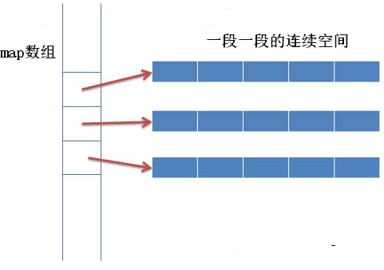
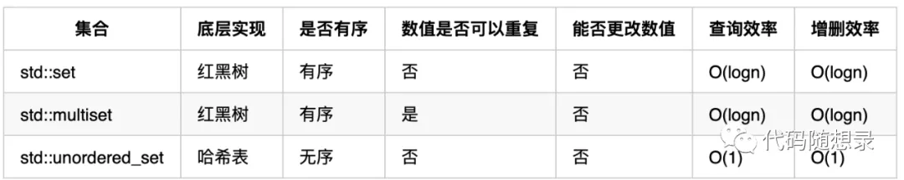
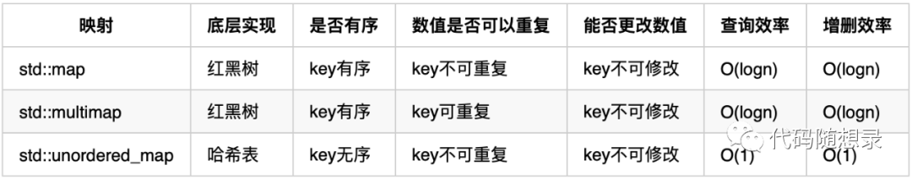
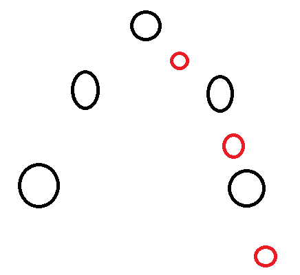
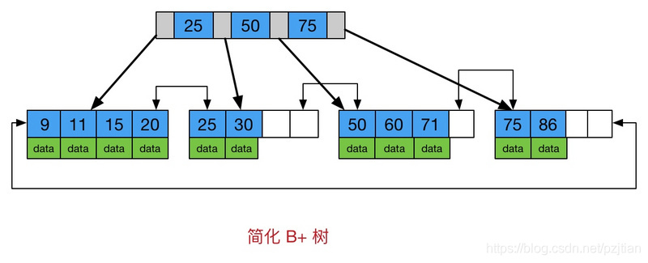

# 数据结构

## STL 容器

### 线程安全

- 多个线程读取是安全的
  - 多个线程可以读同一个容器内的数据，读时不允许写操作
- 多个线程对不同的容器写入是安全的

多线程对同一容器的读写需要加锁

- 对于容器成员函数的每一次调用都锁住该容器直到调用完成
- 在容器返回的迭代器生存期结束之前锁住容器
- 每个容器在调用算法的执行期需要锁定

### 顺序容器

- array：固定大小数组，不能添加或删除元素，快速随机访问
- vector：可变大小数组，在尾部之外的位置插入或删除元素很慢，快速随机访问
- string：与vector相似
- list：双向链表，插入删除很快，双向顺序访问
- forward_list：单向链表，插入删除很快，单向顺序访问
- deque：双端队列，头尾插入删除快，支持快速随机访问
  - deque 容器存储数据的空间是由一段一段等长的连续空间构成，用数组（数组名假设为 map）存储着各个连续空间的首地址
  - deque 容器需要在头部或尾部增加存储空间时，它会申请一段新的连续空间，同时在数组的开头或结尾添加指向该空间的指针，由此该空间就串接到了 deque 容器的头部或尾部。

### 关联容器

set、map：底层是红黑树，红黑树是自动排序的，查找、增删效率O(logn)

unordered_set、unordered_map：底层是哈希表，元素排列无序，查找O(1)，增删O(1)

当我们要使用集合来解决哈希问题的时候，优先使用unordered_set，因为它的查询和增删效率是最优的，如果需要集合是有序的，那么就用set，如果要求不仅有序还要有重复数据的话，那么就用multiset

### resize和reserve的区别

- reserve: 分配空间，更改capacity，但不改变size，为容器预留空间，但并不真正创建元素对象，在创建对象之前，不能引用容器内的元素
- resize: 分配空间，更改capacity，也改变size，并且创建对象，可以引用容器内的对象了

### vector迭代器失效的情况

- 当插入（push_back）一个元素后，end操作返回的迭代器失效
- 当进行删除操作（erase，pop_back）后，指向删除点和它后面的元素的迭代器失效

## 哈希表

利用数组的随机访问特性, 将key-value形式的数据， 其中的key转换成数组下标， 即可实现将其存放到数组中，进而实现随机访问，而其中将key转换成数字的函数, 被称为散列函数， 或哈希函数

设计一个哈希函数, 有如下三点要求：

- 散列函数计算得出的值是一个正整数(数组下标嘛)
- 若key相等, 则计算后的哈希值相等
- 若key不相等, 则计算后的哈希值不相等

**除留余数法**（常用的哈希函数）：用一个特定的质数来除所给定的关键字，所得余数即为该关键字的哈希值

**哈希冲突**（key不同，哈希值相同）

- 开放寻址法：当发生哈希冲突的情况时, 就从当前位置往后找, 找到第一个空缺的位置放入

  - 装载因子 = 表中元素个数 / 表的长度
  - 装载因子越大,，说明空位越少，冲突越多，哈希表的性能越低.
- 再哈希法：使用多个哈希函数，第一个冲突时，使用第二个哈希函数，直到不冲突为止
- 拉链法：将所有哈希值相同的关键字，都链接在同一个链表中

### 拉链法最坏的情况

jdk8中在链表长度超过 8 时从链表转换为红黑树，即在下标内的时间复杂度从单链表的O(N) 降低为红黑树的 O(logN)，而当元素个数少于 6 个时从红黑树转换为单链表。 由于数据比较少时红黑树旋转，节点存储更多的指针等消耗也比较大，性能并不高，所以数据少时使用了单链表。

### 扩容

当容器中元素增多，每个桶中的元素会增加，为了保证效率， hash_map会自动申请更大的内存，以生成更多的桶，因此在insert以后，以前的迭代器有可能是不可用的

扩容时需要满足两个条件：

- 存放新值的时候当前hash_map所有元素的个数大于等于阈值；
- 存放新值的时候发生哈希冲突。

STL会默认指定初始桶大小为16，负载因子是0.75，因此阈值就是16*0.75 = 12，所以当新插入元素时，当前的元素个数超过12，并且发生了冲突，就会扩容hash桶。扩容的大小是给之前的数组翻倍。

## 平衡二叉树（AVL树）

特点：

- 非叶子节点最多拥有两个子节点
- 非叶子节值大于左边子节点、小于右边子节点
- 树的左右两边的层级数相差不会大于1
- 没有值相等重复的节点

AVL 树是高度平衡的，频繁的插入和删除，会引起频繁的rebalance，导致效率下降；

红黑树不是高度平衡的，算是一种折中，插入最多两次旋转，删除最多三次旋转。

## 红黑树

红黑树是为了应对二叉查找树最坏的情况

- 它在每个节点增加了一个存储位表示颜色
- 红黑树可以保证最长路径不超过最短路径的二倍，因此，红黑树是一种近似平衡二叉树。相对于要求严格的AVL树来说，它的旋转次数少，所以对于搜索，插入，删除操作较多的情况下，通常使用红黑树
- 所以红黑树在查找、插入、删除的性能都是O(logn)，且性能稳定，所以STL里面很多结构包括map底层实现都是使用的红黑树

**性质：**

1. 每个结点不是黑色就是红色
2. 根是黑色
3. 如果一个节点是红色的，则它的两个孩子结点是黑色的
4. 对于每个结点，从该结点到其所有后代叶结点的路径上，均包含相同数目的黑色结点——保证了最长路径不超过最短路径的二倍

## 跳表

插入、删除、查找操作时间复杂度是 O(logn)

跳表级数h=log2n - 1，包含原始链表这一层的话，跳表的高度就是 log2n

跳表每层访问节点不超过3个节点，时间复杂度为O(3log2n) = O(log2n)

## b+树特点

- 非叶子结点只存储键、指针信息
- 数据记录都放在叶子结点中
- 叶子结点之间通过指针链接成链表

### 为什么B+树更适合操作系统的文件索引和数据库索引

- B+树的磁盘读写代价更低：非叶子节点不存储数据，节点小，相应的磁盘的I/O次数少
- B+树的查询效率更加稳定：所有关键字数据地址都存在叶子节点上，所以每次查找的次数都相同
- B+树天然具备排序功能：B+树所有的叶子节点数据构成了一个有序链表，在查询大小区间的数据时候更方便，数据紧密性很高，缓存的命中率也会比B树高
- 全表扫描更快：B+树遍历整棵树只需要遍历所有的叶子节点即可，而不需要像B树一样需要对每一层进行遍历，这有利于数据库做全表扫描
- B+树的层级更少：相较于B树B+每个非叶子节点存储的关键字数更多，树的层级更少所以查询数据更快

