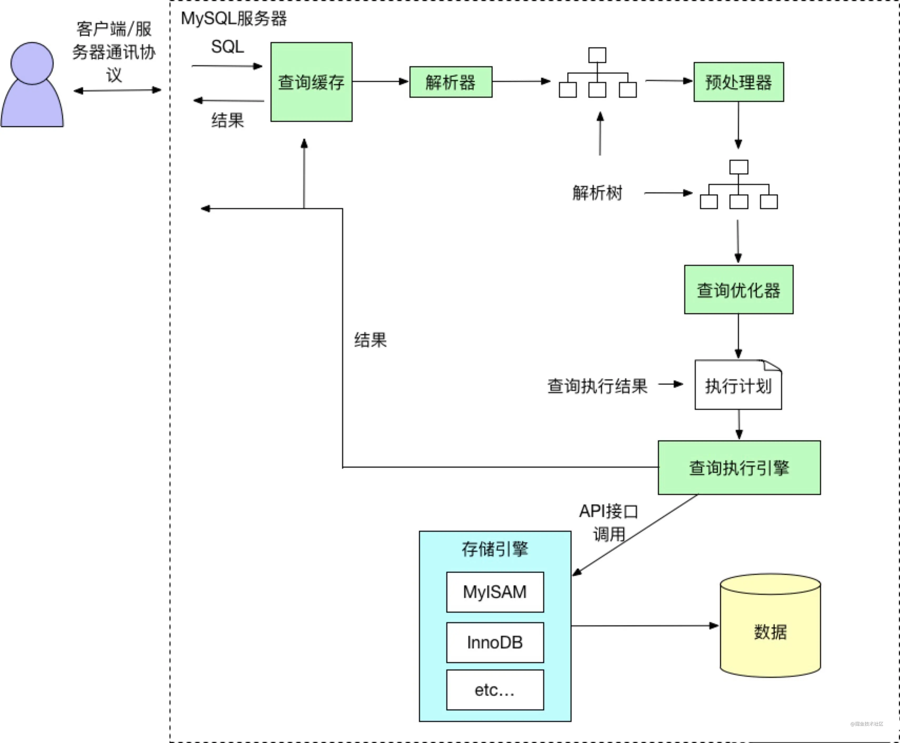
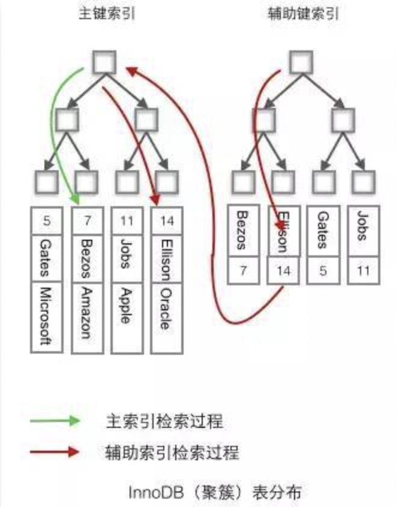
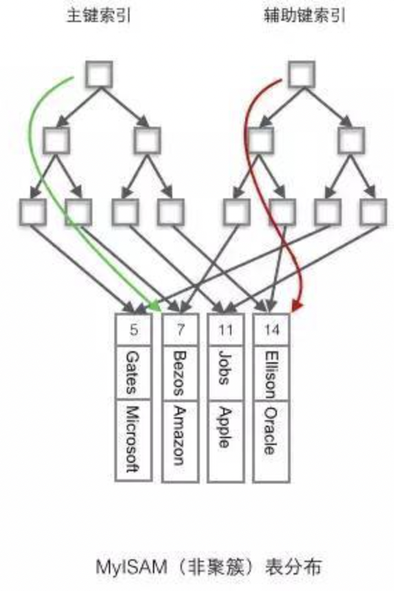
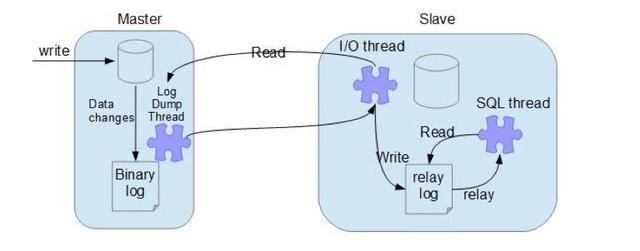

# 数据库

## MySQL执行流程

1. MySQL客户端通过协议将SQL语句发送给MySQL服务器。
2. 服务器会先检查查询缓存中是否有执行过这条SQL，如果命中缓存，则将结果返回，否则进入下一个环节（查询缓存默认不开启）
3. 服务器端进行SQL解析，预处理，然后由查询优化器生成对应的执行计划。
4. 服务器根据查询优化器给出的执行计划，再调用存储引擎的API执行查询。
5. 将结果返回给客户端，如果开启查询缓存，则会备份一份到查询缓存中

## 索引

帮助MySQL提高查询效率的一种数据结构

### 索引类型

- 数据结构维度

  - B+树索引
  - 哈希索引
  - 全文索引：为了解决需要基于相似度的查询，通常用于大文本字段
  - R-树索引

- 物理存储维度

  - 聚簇索引
  - 非聚簇索引

- 逻辑维度

  - 主键索引：一种特殊的唯一索引，一个表只能有一个主键，不允许有空值

  - 普通索引：对列没有任何限制

  - 唯一索引：索引列的值必须唯一，但允许有空值

  - 联合索引：指多个字段上创建的索引，只有在查询条件中使用了创建索引时的第一个字段，索引才会被使用。使用联合索引时遵循最左前缀集合

### 最左前缀原则

即最左优先，在检索数据时从联合索引的最左边开始匹配

MySQL引擎为了更好地利用索引，在查询过程中会动态调整查询字段顺序以利用索引

### 为什么用索引查询会变快

是因为索引使用了B+树数据结构来存储，利用二分查询的原理，有效的减少了磁盘IO的次数，所以查询会变快

### 使用索引查询一定会变快吗

- 索引需要空间来存储，也需要维护。
- B+ 树是一颗平衡树，如果对这颗树新增、修改、删除的话，会破坏它的原有结构
- 我们在做数据新增、修改、删除的时候，需要花额外的时间去维护索引
- 因为索引需要额外的存储空间和处理，那些不必要的索引反而会使查询反应时间变慢
- 所以使用索引查询不一定能提高查询性能

### 聚簇索引（InnoDB）和非聚簇索引（MyISAM）

- 聚簇索引：将数据存储与索引放到一块，索引结构的叶子结点保存了行数据
  - 主键索引一定是聚簇索引；聚簇索引不一定是主键索引
- 非聚簇索引：将数据与索引分开存储，索引结构的叶子结点指向了数据的位置

InnoDB

- 使用聚簇索引，将主键组织到B+树上，行数据存储在叶子结点
- 聚簇索引默认是主键索引
- 只有一个聚簇索引

  - 若表存在主键，则主键索引就是聚集索引。
  - 若不存在主键，则会把第一个非空的唯一索引作为聚集索引。
  - 否则，就会隐式的定义一个 rowid 作为聚集索引。

MyISAM

- 使用非聚簇索引，非聚簇索引的主键索引B+树和辅助索引B+树结构相同
- 表数据存储在独立的地方，两颗B+树的叶子结点使用同一个地址指向表数据
- 由于索引树独立，通过辅助键检索无需访问主键的索引树

#### 聚簇索引的优点

- 聚簇索引的行数据和叶子结点存储在一起，找到叶子结点立刻将数据返回访问行数据时
- 已经把页加载到buffer中，访问同一页其他行数据时，不必访问磁盘
- 辅助索引的叶子结点存储主键值，而不是数据的地址。
  - 当行数据发生变化时，主键索引的节点也需要变化，但是辅助索引存储的主键值不变，避免对辅助索引的维护工作
  - 减小辅助索引的存储空间

#### 聚簇索引的缺点

- 维护索引很昂贵，特别是插入新行或者主键被更新导致需要移动行的时候，可能面临“页分裂”的问题。页分裂会导致表占用更多的磁盘空间
- 聚集索引可能导致全表扫描变慢，尤其是行比较稀疏，或者由于页分裂导致数据存储不连续的时候

#### 为什么主键通常建议使用自增id

聚簇索引的数据的物理存放顺序与索引顺序是一致的，即：只要索引是相邻的，那么对应的数据一定也是相邻地存放在磁盘上的。如果主键不是自增id，会不断地调整数据的物理地址、分页。如果是自增的，那就简单了，它只需要一 页一页地写，索引结构相对紧凑，磁盘碎片少，效率也高。

### 什么情况下不能用索引（索引失效）

- 联合索引：不符合最左前缀原则，当遇到范围查询（>、<、between、like）就会停止匹配
- like关键字：匹配字符串的第一个字符是"%"
- or关键字：or的前后有一个条件列不是索引

### 覆盖索引

覆盖索引不用回表

方法：将被查询（select）的字段，建立到联合索引里去

## 事务

事务：事务就是一系列操作，要么同时成功，要么同时失败

### 事务的四种隔离级别

#### 1、读未提交：一个事务可以读取另一个未提交事务的数据

脏读：看到还没提交事务时的数据

#### 2、读提交：一个事务要等另一个事务提交后才能读取数据

读提交，能解决脏读问题

不可重复读：一个事务范围内两个相同的查询却返回了不同数据

不可重复读举例：程序员拿着信用卡去享受生活（卡里当然是只有3.6万），当他埋单时（程序员事务开启），收费系统事先检测到他的卡里有3.6万，就在这个时候！！程序员的妻子要把钱全部转出充当家用，并提交。当收费系统准备扣款时，再检测卡里的金额，发现已经没钱了（第二次检测金额当然要等待妻子转出金额事务提交完）

#### 3、重复读：一个事务执行过程中看到的数据，总是跟这个事务在启动时看到的数据是一致的

就是在开始读取数据（事务开启）时，不再允许修改操作，重复读可以解决不可重复读问题

- 不可重复读对应的是修改UPDATE操作。
- 幻读对应的是插入INSERT操作

幻读举例：程序员某一天去消费，花了2千元，然后他的妻子去查看他今天的消费记录（全表扫描FTS，妻子事务开启），看到确实是花了2千元，就在这个时候，程序员花了1万买了一部电脑，即新增INSERT了一条消费记录，并提交。当妻子打印程序员的消费记录清单时（妻子事务提交），发现花了1.2万元，似乎出现了幻觉，这就是幻读

#### 4、序列化：可以解决幻读问题

Serializable 序列化：Serializable 是最高的事务隔离级别，在该级别下，**事务串行化顺序执行**，可以避免脏读、不可重复读与幻读。但是这种事务隔离级别效率低下，比较耗数据库性能，一般不使用

参考：https://www.huaweicloud.com/articles/ffc11869bfea5f6793631f9b30369be0.html

### 事务四大特性ACID

- 原子性（ Atomicity ）
- 一致性（ Consistency ）
- 隔离性（ Isolation ）
- 持久性（ Durability ）

### 2PC、3PC、TCC

2PC：两阶段提交协议，整个事务流程分为两个阶段，准备阶段（Prepare phase）、提交阶段（commit phase）

3PC：在两阶段提交的基础上**增加了CanCommit阶段**，并**引入了超时机制**。一旦事务参与者迟迟没有收到协调者的Commit请求，就会自动进行本地commit，这样相对有效地解决了协调者单点故障的问题

TCC：预处理Try、确认 Confirm、撤销Cancel。

- Try阶段：主要是对业务系统做检测及资源预留
- Confirm阶段：确认执行业务操作
- Cancel阶段：取消执行业务操作

## 日志

- 重做日志（redo log）：在事务执行的过程中如果发生异常（数据库崩溃），在重启MySQL服务的时候，根据Redo Log进行重做，进而恢复事务的状态。
- 回滚日志（undo log）：撤销未提交的事务
- 二进制日志（bin log）：记录了对数据库执行更改的所有操作
- 错误日志（error log）：运行过程中较为严重的警告和错误信息；服务器启动和关闭过程中的信息
- 慢查询日志（slow query log）：记录下查询超过指定时间的语句
- 通用查询日志（general log）：记录了数据库执行的所有命令
- 中继日志（relay log）：从库服务器I/O线程将主库服务器的二进制日志读取过来记录到从库服务器本地文件

## SQL查询如何优化

- 避免出现SELECT * FROM table 语句，要明确查出的字段。
- 在一个SQL语句中，如果一个where条件过滤的数据库记录越多，定位越准确，则该where条件越应该前移。
- 查询时尽可能使用索引覆盖。即对SELECT的字段建立复合索引，这样查询时只进行索引扫描，不读取数据块。
- 在判断有无符合条件的记录时建议不要用SELECT COUNT （*）和select top 1 语句。
- 应绝对避免在order by子句中使用表达式。
- 应尽量避免在 where 子句中使用!=或<>操作符，否则将引擎放弃使用索引而进行全表扫描。
- 对查询进行优化，应尽量避免全表扫描，首先应考虑在 where 及 order by 涉及的列上建立索引。
- 应尽量避免在 where 子句中对字段进行 null 值判断，否则将导致引擎放弃使用索引而进行全表扫描，如：
  `select id from t where num is null`
  可以在num上设置默认值0，确保表中num列没有null值，然后这样查询：
  `select id from t where num=0`
- 应尽量避免在 where 子句中使用 or 来连接条件，否则将导致引擎放弃使用索引而进行全表扫描，如：
  `select id from t where num=10 or num=20`
  可以这样查询：
  `select id from t where num=10 union all select id from t where num=20`
- 下面的查询也将导致全表扫描：(不能前置百分号)
  `select id from t where name like ‘%abc%’`
  若要提高效率，可以考虑全文检索。

## 左、右、内连接

- left join （左连接）：返回包括左表中的所有记录和右表中连接字段相等的记录。
- right join （右连接）：返回包括右表中的所有记录和左表中连接字段相等的记录。
- inner join （内连接）：只返回两个表中连接字段相等的行。

## where和having的区别

- where 子句是对查询结果进行分组前过滤数据，条件中不能包含聚和函数
- having 子句的作用是筛选满足条件的组，即在分组之后过滤数据，条件中经常包含聚合函数

## 数据库建表需要注意什么

- 字符集：选择 `utf-8`
- 数据库名、表名建议小写，以 `t `开头，单词之间可以试用 `_`隔开
- 数据库引擎使用：`InnoDB`（支持事务）
- 主键使用自增id
- 经常作为 where 条件的字段最好添加索引

## 主从复制

MySQL基于 `Bin-log`日志完成数据的异步复制，因为 `Bin-log`日志中会记录所有对数据库产生变更的语句，包括DML（Data Manipulation Languag）数据变更和DDL（Data Definition Language）结构变更语句

- 客户端将写入数据的需求交给主库，主库先向自身写入数据，数据写入完成后，紧接着会再去记录一份 `Bin-log`二进制日志。
- 配置主从架构后，主库上会创建一条专门监听 `Bin-log`日志的 `log dump`线程。当 `log dump`线程监听到日志发生变更时，会通知从库来拉取数据。
- 从库会有专门的 `I/O`线程用于等待主库的通知，当从库在主库上请求到一定数据后，接着会将得到的数据写入到 `relay-log`中继日志。
- 从库上也会有专门负责监听中继日志变更的 `SQL`线程，当中继日志出现变更后，从中读取日志记录，然后解析日志并将数据写入到自身磁盘中。

基于GTID的主从复制的方式

- 基于日志的复制， 从库需要告知主库要从哪个日志（Bin-log）哪个偏移量（POS）进行增量同步，如果指定错误会造成数据的遗漏，从而造成数据的不一致
- 而基于GTID（global transaction identifier，全局事务ID）的复制中， 从库会告知主库已经执行的事务的GTID的值， 然后主库会将所有未执行的事务的GTID的列表返回给从库。并且可以保证同一个事务只在指定的从库执行一次
- GTID是由server_uuid和事务id组成，格式为：GTID=server_uuid:transaction_id。server_uuid是在数据库启动过程中自动生成，每台机器的server-uuid不一样。uuid存放在数据目录的auto.conf文件中，而transaction_id就是事务提交时系统顺序分配的一个不会重复的序列号
- 主库更新数据时，会在事务前产生GTID，一起记录到bin-log日志中。从节点的I/O线程将变更的bin-log，写入到本地的relay-log中。SQL线程从relay-log中获取GTID，然后对比本地bin-log是否有记录（所以MySQL从节点必须要开启bin-log）。如果有记录，说明该GTID的事务已经执行，从节点会忽略。如果没有记录，从节点就会从relay-log中执行该GTID的事务，并记录到binlog
- 开启GTID后，发生主从切换时就无需手动寻点了，仅需要执行 `change master to master_auto_position = 1`这条命令即可，它会自动去新主库上寻找数据的同步点，也就是MySQL自身就具备断点复制的功能
