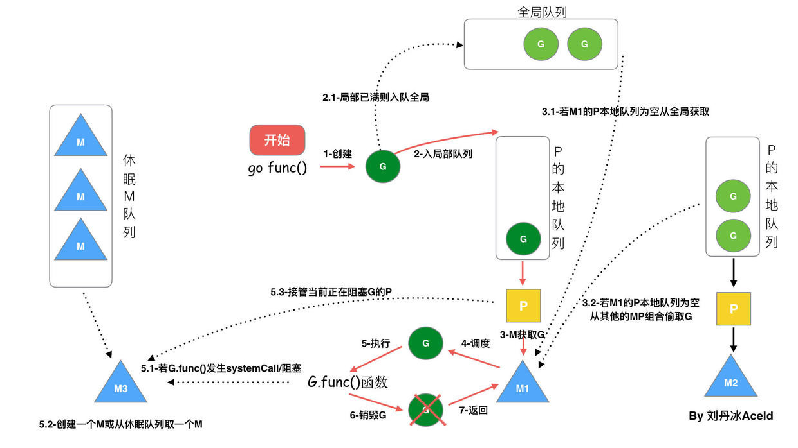

# Golang

## go mod

### go mod tidy

保持依赖整洁，清理未使用的依赖，更新 go.mod 以及 go.sum 文件。

当执行 go mod tidy 时，Go 工具链会进行如下操作：

- 扫描你的项目中所有的 Go 文件，分析其中的 import 声明。
- 确定哪些模块是项目真正依赖的，即哪些模块是被直接或间接引用的。
- 任何 go.mod 文件中存在但项目中未引用的依赖将会被移除。
- 对于缺失的依赖（即代码中引用但未在 go.mod 文件声明的），它会尝试添加适当的版本。
- 更新 go.sum 文件，包含所有依赖项的预期加密校验和

### go mod vendor

在项目根目录中会创建一个 vendor 目录，该目录包含项目依赖的版本的副本。

执行 go mod vendor 时，Go 会进行以下操作：

- 根据 go.mod 文件中的依赖项，复制依赖到项目的 vendor 目录下。
- 依赖项的源代码将被拷贝过来，确保无网络环境下也能构建项目。
- 生成一个 modules.txt 文件在 vendor 目录下，列出所有 vendor 的依赖和它们的版本信息

使用vendor管理依赖的场景

- **网络隔离构建**：在某些环境下无法直接连接到网络，需要提前下载所有依赖。
- **确保依赖的一致性**：防止因为依赖仓库的不稳定导致的构建失败。
- **支持旧的构建系统**：一些旧的 Go 构建系统或工具可能还不支持模块，需要 `vendor` 目录

## GMP

Go的运行时（runtime）采用了GMP模型来管理和调度Goroutines

- Goroutine（G）：G是Go语言并发编程的核心，类似于轻量级线程，由Go运行时管理和调度。每一个Goroutine都有自己的栈空间，但相比系统线程，其初始栈空间占用更小，且可以动态扩缩，因此创建和销毁的代价更低。
- Machine（M）：M代表了真实的操作系统线程。由M来执行G，每个M都会关联一个操作系统线程。M的创建、销毁和切换都需要系统调用，代价相对较高。
- Processor（P）：P是G和M之间的调度器，负责调度G到M上执行。每个P维护一个本地G队列。P的数量一般等于CPU的核心数，这样可以最大限度地利用多核资源。



- 每个P有个局部队列，局部队列保存待执行的goroutine(流程2)，当M绑定的P的的局部队列已经满了之后就会把goroutine放到全局队列(流程2-1)
- 每个P和一个M绑定，M是真正的执行P中goroutine的实体(流程3)，M从绑定的P中的局部队列获取G来执行
- 当M绑定的P的局部队列为空时，M会从全局队列获取到本地队列来执行G(流程3.1)，当从全局队列中没有获取到可执行的G时候，M会从其他P的局部队列中偷取G来执行(流程3.2)，这种从其他P偷的方式称为**work stealing**
- 当G因系统调用(syscall)阻塞时会阻塞M，此时P会和M解绑即**hand off**，并寻找新的idle的M，若没有idle的M就会新建一个M(流程5.1)。
- 当G因channel或者network I/O阻塞时，不会阻塞M，M会寻找其他runnable的G；当阻塞的G恢复后会重新进入runnable进入P队列等待执行(流程5.3)

**本地队列和全局队列的区别？**

本地队列是每个P自己的Goroutine队列，全局队列是所有P共享的Goroutine队列。在调度过程中，Go语言优先使用本地队列，当本地队列为空时，才会去全局队列或者其他P的本地队列获取Goroutine，本地队列满的时候也会放入全局队列

## GC

**v1.3 标记清除法**

- 开启STW，停止程序的运行
- 从根节点出发，标记所有可达对象
- 停止STW，然后回收所有未被标记的对象

**v1.5 三色标记法**

- 启动STW
- 新创建的对象默认颜色是白色
- GC回收从根节点一次遍历所有对象，把遍历到的对象从白色集合放入灰色集合。
- 循环遍历灰色集合，将灰色对象引用的对象从白色集合放入灰色集合，之后将此灰色对象放入黑色集合，直到灰色中无任何对象
- 停止STW
- 回收所有的白色标记表的对象

**v1.8 混合写屏障机制**

- GC开始将栈上的对象全部扫描并标记为黑色(之后不再进行第二次重复扫描，无需STW)
- GC期间，任何在栈上创建的新对象，均为黑色
- 堆上被添加和删除的对象标记为灰色

总结

- Golang v1.3之前采用传统采取标记清除法，需要STW，暂停整个程序的运行。
- 在v1.5版本中，引入了三色标记法和插入写屏障机制，其中插入写屏障机制只在堆内存中生效。但在标记过程中，最后需要对栈进行STW。
- 在v1.8版本中结合删除写屏障机制，推出了混合屏障机制，屏障限制只在堆内存中生效。避免了最后节点对栈进行STW的问题，提升了GC效率

## 数据结构

### channel

#### channel的原理

Channel用于goroutine之间的数据通信。它通过维护一个队列来进行通信，当一个goroutine想要发送数据时，将数据放入队列中；当另一个goroutine需要接收数据时，从队列中取出数据。底层是一个 `runtime.hchan`结构体

```
type hchan struct {
    qcount   uint              // 循环队列元素的数量
    dataqsiz uint             // 循环队列的大小
    buf      unsafe.Pointer // 循环队列缓冲区的数据指针
    elemsize uint16            // chan中元素的大小
    closed   uint32            // 是否已close
    elemtype *_type            // chan 中元素类型
    sendx    uint            // send 发送操作在 buf 中的位置
    recvx    uint            // recv 接收操作在 buf 中的位置
    recvq    waitq            // receiver的等待队列
    sendq    waitq            // senderl的等待队列

    lock mutex                // 互斥锁，保护所有字段
}
```

#### channel出现panic的场景

1. 关闭为nil的channel
2. 关闭已经关闭的channel
3. 向一个已经关闭的channel写数据

### context

**实现原理**

Go语言中的 `context`通过实现 `Context`接口来进行工作，接口定义了 `Deadline()`，`Done()`，`Err()`和 `Value()`等方法。`context`包定义了两种主要类型：`emptyCtx`和 `cancelCtx`。`emptyCtx`是一个基础的空 `context`，`cancelCtx`则包含了可以被取消的 `context`。通过 `WithCancel`, `WithDeadline`, `WithTimeout`等函数，可以在父 `context`的基础上创建新的 `context`，添加取消、超时等行为。数据和取消信号的传递是通过链式存储和查找实现的，每个 `context`都保存了对其父 `context`的引用。当 `context`被取消或达到 `Deadline`时，所有关联的 `context`都会收到取消信号。这是通过在 `cancelCtx`中维护一个取消通道(`done`)和一个注册子 `context`的列表(`children`)来实现的。

**context.WithCancel()是怎么取消 context的**

当 `cancel` 函数被调用时，`context` 的取消状态会被设置为已取消，`Done` 通道会被关闭。因为 `Done` 通道是广播式的，关闭 `Done` 通道会向所有监听该通道的 `goroutine` 发送信号

### Sync.map

Sync.map怎么实现并发安全？

通过读写锁（`sync.RWMutex`）、原子操作和“只读”映射的设计来实现并发安全。

- 读写锁：`sync.Map`使用读写锁来防止在并发读取和写入数据时发生冲突，提高并发安全性。读操作在读取数据时可以并行进行，而写操作会阻止任何其他读取或写入操作，以确保数据一致性。
- 原子操作：还使用了 Go 语言的 `atomic` 包来进行一些原子操作。原子操作是指在多线程环境中，一个操作在执行过程中不会被其他线程干扰，它是一个不可分割的整体。这也是保证并发安全的一种方式
- “只读”映射：当数据被频繁读取但很少修改时，`sync.Map`会创建一个只读的映射副本，大多数读取操作可以直接在只读映射上进行，不需要获取读锁，进一步提高性能。

所以，`sync.Map`适用于读操作远多于写操作的场景，通过减少锁的竞争，提高了并发性能

### 哪些是引用类型

go只有值传递，都是一个副本，一个拷贝

- 拷贝的内容是非引用类型（int、string、struct等这些），这样就在函数中就无法修改原内容数据
- 有的是引用类型（指针、map、slice、chan等这些），这样就可以修改原内容数据

函数修改数组（长度固定）不会影响原数组，但是切片会影响。因为将数组作为参数传递给函数时，实际上是传递了一个数组的副本，而切片作为参数传递给函数时，你实际上是在传递切片的引用

## Goroutine

### Goroutine的通信方式

- **Channels**: 这是Go推荐的方式，可以通过创建channel，并通过channel发送和接收数据实现goroutine之间的通信。Channel可以保证发送和接收操作的原子性，因此可以用来在goroutine之间同步数据。
- **共享内存**：在Go中，可以使用锁（比如sync.Mutex或sync.RWMutex）来保护共享资源，从而实现goroutine之间的通信。
- **sync.Cond**：这是一种条件变量的同步原语，可以在一些复杂的同步场景中使用。

### Goroutine出现内存泄露的原因

- 长期运行的 Goroutine：如果一个 Goroutine 长期运行而不退出，它占用的内存将一直无法被回收。
- 死循环，未释放的资源：如果 Goroutine 使用了某些资源（例如打开了文件或数据库连接），但在完成后没有正确地关闭或释放这些资源，那么这些资源就会一直占用内存
- Channel阻塞
  - 写操作没有读导致阻塞（无缓冲或者有缓冲但是缓冲满了）
  - 读操作没有写导致阻塞

内存泄露的场景

## new和make的区别

- `new` 仅分配内存，不初始化值
- `make` 在内存分配的同时，还会进行相关类型的初始化

## GRPC

### RPC

RPC 代指远程过程调用（Remote Procedure Call），允许一台计算机的程序调用另一台计算机的程序

### Protobuf

Protocol Buffers 是一种与语言、平台无关，可扩展的序列化结构化数据的方法，常用于通信协议，数据存储等等。相较于 JSON、XML，它更小、更快、更简单

### GRPC

gRPC是谷歌开源的RPC框架


1、客户端（gRPC Sub）调用 A 方法，发起 RPC 调用

2、对请求信息使用 Protobuf 进行对象序列化压缩（IDL）

3、服务端（gRPC Server）接收到请求后，解码请求体，进行业务逻辑处理并返回

4、对响应结果使用 Protobuf 进行对象序列化压缩（IDL）

5、客户端接受到服务端响应，解码请求体。回调被调用的 A 方法，唤醒正在等待响应（阻塞）的客户端调用并返回响应结果
