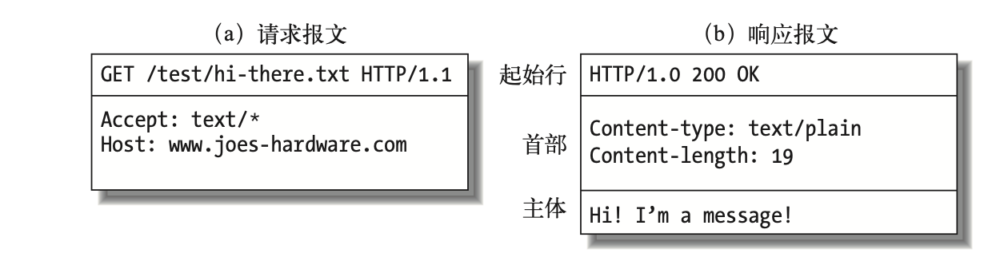

# 计网

## OSI七层协议

物理层：以二进制形式在物理媒介上传输数据

数据链路层：提供介质访问和链路管理

网络层：为数据包选择路由（`IP，ICMP`协议）

传输层：提供可靠的端到端的接口（TCP、UDP）

会话层：组织和协调两个会话进程之间的通信

表示层：处理用户信息的表示问题，如编码、数据格式转换和加密解密

应用层：为用户提供常用的应用程序（HTTP）

- TPC/IP协议是传输层协议，主要解决数据如何在网络中传输
- HTTP是应用层协议，主要解决如何包装数据
- Socket不属于协议范畴，而是一个调用接口（API），是对TCP/IP协议的封装

### 为什么要分层

- 易于实现和标准化各层独立，就可以把大问题分割成多个小问题，利于实现
- 灵活性好：如果某一层发生变化，只要接口不变，不会影响其他层
- 分层后，用户只关心用到的应用层，其他层用户可以复用
- 各层之间相互独立：高层不需要知道底层的功能是怎么实现的，只需要知道通过底层的接口来获得所需要的服务

## TCP、UDP的区别

- TCP 是面向连接的，UDP 是面向无连接的
- TCP 是面向字节流的，UDP 是基于数据报的
- UDP 程序结构较简单
- TCP 是可靠的，UDP不可靠

  - 保证数据正确性，UDP 可能丢包
  - TCP 保证数据顺序，UDP 不保证

## TCP为什么可靠

- 确认和重传：接收方收到报文就会确认，发送方发送一段时间后没有收到确认就重传。
- 数据校验
- 数据合理分片和排序：
- 流量控制：当接收方来不及处理发送方的数据，能降低发送方的发送速度，防止包丢失。
- 拥塞控制：当网络拥塞时，减少数据的发送。

## UDP如何实现可靠传输

传输层UDP已经是不可靠的连接，那就要在应用层自己实现一些保障可靠传输的机制

- 超时重传（定时器）
- 有序接收 （添加包序号）
- 应答确认 （seq/ack应答机制）
- 滑动窗口流量控制等机制 （滑动窗口协议）

## UDP为什么比TCP要更快

UDP没有流量控制、拥塞控制、没有握手、没有成功确认，一个数据包发过去就不管。TCP开销大一点

## 拥塞控制的算法

- 慢开始：不要一开始就发送大量的数据，先探测一下网络的拥塞程度，由小到大逐渐增加拥塞窗口的大小
- 拥塞避免：让拥塞窗口按线性规律缓慢增长
- 快重传：接收方在收到一个失序的报文段后就立即发出重复确认
- 快恢复：当发送方连续收到三个重复确认时，就执行“乘法减小”算法，把 `ssthresh`门限减半（为了预防网络发生拥塞）

### 乘法减小和加法增大

- “乘法减小”：无论是在慢开始阶段还是在拥塞避免阶段，只要发送方判断网络出现拥塞，就把慢开始门限 `ssthresh`设置为出现拥塞时的发送窗口大小的一半，并执行慢开始算法
- “加法增大”是指执行拥塞避免算法后，使拥塞窗口缓慢增大，以防止过早出现拥塞

## 拥塞控制和流量控制的区别

- 拥塞控制：拥塞控制是作用于网络的，它是防止过多的数据注入到网络中，避免出现网络负载过大的情况；

  常用的方法就是：（ 1 ）慢开始、拥塞避免（ 2 ）快重传、快恢复。
- 流量控制：流量控制是作用于接收者的，它是控制发送者的发送速度从而使接收者来得及接收，防止分组丢失的。

## 拥塞窗口和滑动窗口的区别

- 拥塞窗口：是作用于网络的，它是防止过多的数据注入到网络中，避免出现网络负载过大的情况
- 滑动窗口：接收数据端使用的窗口大小，用来告知发送端接收端的缓存大小，以此可以控制发送端发送数据的大小，从而达到流量控制的目的

## 粘包和拆包

粘包：发送的多个报文被合并成一个大的报文进行传输

拆包：一个数据包拆成多个

### 粘包拆包解决方法

- 发送端给每个数据包添加包首部，首部中应该至少包含数据包的长度，这样接收端在接收到数据后，通过读取包首部的长度字段，便知道每一个数据包的实际长度了
- 发送端将每个数据包封装为固定长度（不够的可以通过补0填充），这样接收端每次从接收缓冲区中读取固定长度的数据就自然而然的把每个数据包拆分开来
- 可以在数据包之间设置边界，如添加特殊符号，这样，接收端通过这个边界就可以将不同的数据包拆分开

## 三次握手

- A向B发出请求报文段，首部中的同步位SYN=1，初始序号seq=x
- B收到连接请求报文段后，向A发送确认，在确认报文段中把SYN位和ACK位都置1，确认号ack=x+1,也选择一个初始序号seq=y
- A收到B的报文后，还要给B发出确认。确认报文段的ACK置1，确认号ack=y+1，序号seq=x+1

ACK：确认ACK，只有ACK=1，确认号字段才有效

ack：确认序列号，期望收到对方下一个报文段的第一个数据字节的序号

### 为什么要三次握手

为了防止已失效的连接请求报文段又传送到了B。这样子B会认为是A新的连接请求，如果没有三次握手，那么连接就建立了，但是A并没有发出连接请求，也不发送数据，B的资源就浪费了。

### TCP连接”三次握手“的异常情况

- 客户端第一个【SYN】包丢了：客户端会进行三次重传【SYN】包
- 服务器端收到【SYN】回复，但是回复的【SYN，ACK】包丢了：客户端会进行如上的重传；服务器端也会进行重传
- 客户端收到【SYN，ACK】包，在回复时丢失【ACK】包：客户端会进入 ESTABLISHED状态，向服务器端发送数据；服务器端虽然没有接收到客户端最后发来【ACK】包，但是因为数据包携带ACK的确认序号，所以在接收到数据包时，会认为连接已经建立，变为ESTABLISHED状态

### 如果接收缓冲区满了，发送端怎么操作

- 接收方只要收到了包，就会发ACK包
- TCP在发送ACK包的同时会带有window大小值，表示这边能接受的数据量。发送方会根据这个调整数据量
- 接收方缓冲区满时，回给发送方的window值就是0
- 发送方看到window为0的包，会启动一个定时器，隔一段时间发一个包试探
- 一旦接收方缓冲区有足够空间了，就会给window赋上非0值。发送方就又开始发送了

## 四次挥手

- A向B发送FIN=1（1代表请求断开连接），seq=u，发送后，A进入FIN-WAIT-1 终止等待1状态。
- 当B收到A的请求后，回复ACK=1（确认收到），seq=v，ack=u+1，当B发送后，进入CLOSE-WAIT关闭等待状态
- A收到B的回复后，进入FIN-WAIT-2终止等待2状态，因为B仅仅是回复了，我收到你的断开请求了，但是B没说是否同意断开，所以A继续等待。
- 服务器B再次发送FIN=1（发送中断请求，即同意中断），ACK=1（确认收到），seq=w，B重复上次发送过的确认号ack=u+1，当B发送后进入LAST-ACK最后确认状态。
- 当A收到B的中断请求后，发送回复，ACK=1（确认收到），seq=u+1，ack=w+1，发送完后A进入TIME-WAIT时间等待状态，因为网络中可能还有数据在传输，所以A要等待一段时间，确认这些数据发送成功
- 当B收到A的确认后，进入CLOSED关闭状态，断开与A连接

### 为什么要四次挥手

TCP连接时是同步的，但结束时是不同步的，当挥手第二次后宣告了主动关闭方不会再主动发送数据，但仍然可以接收数据，此时处于半关闭状态。这样被动关闭方有足够的时间去处理以前没有处理完的数据，它可能还有一部分数据没发送出去需要处理，在此之后提出主动关闭连接。**所以4次挥手的设计为连接双方都提供了一定的处理扫尾工作的时间**

### 为什么A在TIME-WAIT状态要等2MSL（最长报文段寿命）

- 保证A发送的最后一个ACK报文段能到达B
- 让本次连接中的所有网络包都消失（等一段时间），防止“本次连接请求报文段”出现在下一次连接中

### 大量TIME-WAIT的危害和解决方法

### 危害

服务器维护每一个连接需要一个socket，也就是每个连接会占用一个文件描述符，而文件描述符的使用是有上限的，如果持续高并发，会导致一些连接失败。

### 解决方法：端口重用

设置套接字选项为SO_REUSEADDR，告诉操作系统，如果端口忙，但占用该端口TCP连接处于TIME_WAIT状态，并且套接字选项为SO_REUSEADDR，则该端口可被重用。如果TCP连接处于其他状态，依然返回端口被占用。该选项对服务程序重启非常有用。

参考：

https://www.huaweicloud.com/articles/8eb01316cf196d1d01905efbb029ee13.html

## HTTP协议

- HTTP 协议构建于 TCP/IP 协议之上，是一个应用层协议，默认端口号是 80
- HTTP 是无连接无状态的
- http请求由三部分组成：请求行、请求头、请求体
- 常用的HTTP方法：
  - GET： 向服务器请求资源，可以通过URL传参给服务器
  - POST：用于传输信息给服务器，主要功能与GET方法类似，但一般推荐使用POST方式
  - PUT： 传输文件，报文主体中包含文件内容，保存到对应URI位置
  - HEAD： 获得报文首部，与GET方法类似，只是不返回报文主体，一般用于验证URI是否有效
  - DELETE：删除文件，与PUT方法相反，删除对应URI位置的文件
  - OPTIONS：查询相应URI支持的HTTP方法

请求报文的格式：

`<method>` `<request-URL>` `<version>`

<headers>

<entity-body>

响应报文的格式（注意，只有起始行的语法有所不同）：

`<version>` `<status>` `<reason-phrase>`

<headers>

<entity-body>

## HTTP通信的过程

HTTP通信的过程主要涉及客户端（例如，web浏览器）和服务器之间的请求和响应：

1. **建立连接**：客户端首先与服务器建立TCP连接，这通常涉及到三次握手过程。
2. **发送请求**：一旦TCP连接建立，客户端就会向服务器发送一个HTTP请求。这个请求包括请求行（例如，"GET /index.html HTTP/1.1"），请求头（例如，"Accept: text/html"），以及可能的请求体。
3. **处理请求**：服务器收到请求后，解析它并决定如何响应。这可能涉及到查找请求的资源，运行服务器端的脚本，或者与数据库进行交互。
4. **发送响应**：服务器生成一个HTTP响应，并将其发送回客户端。这个响应包括起始行（例如，"HTTP/1.1 200 OK"），响应头（例如，"Content-Type: text/html"），以及响应体（通常包括请求的资源内容）。
5. **处理响应**：客户端接收到响应后，会解析它并根据响应内容进行进一步的处理，例如渲染网页，下载文件，或者显示错误消息。
6. **关闭连接**：一旦服务器发送了响应，它通常会关闭TCP连接。然而，如果使用HTTP/1.1或更高版本，并且"Connection: keep-alive"头被设置，那么连接可以保持打开状态，以便于后续的请求。

## GET方法与POST方法的区别

- get是不安全的，因为URL是可见的，可能会泄露私密信息，如密码等
- get重点在从服务器上获取资源，post重点在向服务器发送数据
- get传输数据是通过URL请求；post传输数据通过http的post机制，将字段与对应值封存在请求实体中发送给服务器，这个过程对用户是不可见的
- get传输的数据量小，因为受URL长度限制，但效率较高；post可以传输大量数据，所以上传文件时只能用post方式
- get方式只能支持ASCII字符，向服务器传的中文字符可能会乱码；post支持标准字符集，可以正确传递中文字符

## HTTP的缺点与HTTPS

- 通信使用明文不加密，内容可能被窃听
- 不验证通信方身份，可能遭到伪装
- 无法验证报文完整性，可能被篡改

HTTPS就是HTTP加上SSL加密 + 认证 + 完整性保护

SSL采用的非对称加密

### 对称加密（共享密钥加密）

加密和解密使用相同的密钥，在通信时还需将传输密钥给对方用来解密，密钥传输过程中同样可能被截获

### 非对称加密（公开密钥加密）

发送密文的一方要使用对方的公开密钥进行加密，对方收到信息之后，使用自己的私有密钥进行解密，这种方式不需要传输用来解密的私钥了，也就不必担心私钥被截获

## HTTPS加密过程

1. 客户端请求服务器获取 `证书公钥`
2. 客户端(SSL/TLS)解析证书（无效会弹出警告）
3. 生成随机值
4. 用 `公钥`加密随机值生成 `密钥`
5. 客户端将 `密钥`发送给服务器
6. 服务端用 `私钥`解密 `密钥`得到随机值
7. 将信息和随机值混合在一起进行对称加密
8. 将加密的内容发送给客户端
9. 客户端用 `密钥`解密信息

## MD5加密

MD5是哈希算法的一种，可以将任意数据产生出一个128位（16字节）的散列值，用于确保信息传输完整一致，它是不可逆的，不可以解密

MD5应用：

- 我们常在注册登录模块使用MD5，用户密码经过MD5加密后存入数据库。
- 这样用户在登录的时候，密码经过MD5加密后再与数据库中存储的数据对比，如果相同，则验证成功！
- 避免有人直接入侵数据库，获取用户密码信息！

## Base64

是什么：用文本表示二进制的编码方式，它使用4个字节的文本来表示3个字节的原始二进制数据

作用：常用于网络传输，在一些基于文本的协议中，如果需要传输图片或者文件等，我们知道图片的存储格式是二进制数据，而非文本格式，我们必须将二进制的数据编码成文本格式

Base64编码之后往往比原始数据要大，所以它并没有压缩数据

## http1.0、1.1、2.0区别

- HTTP 1.0
  - 只保持短暂的连接，连接无法复用
- HTTP 1.1
  - 默认支持长连接
  - 在同一个TCP连接里面，客户端可以同时发送多个请求
  - 新增了一些请求方法（put，delete，options）
  - 新增了一些请求头和响应头（host）
- HTTP 2.0
  - 多路复用：客户端和浏览器都可以同时发送多个请求或回应，不用按照顺序一一对应，避免了消息头堵塞
  - 二进制分帧：采用二进制格式传输数据，而非 `HTTP 1.x`的文本格式，解析起来更高效
  - 首部压缩：在客户端和服务器端使用“首部表”来跟踪和存储之前发送的键值对，只需要发送差异数据
  - 服务器推送：允许服务端推送资源给客户端，适合加载静态资源

## http 状态码

- 200 请求被成功处理
- 301 永久性重定向
- 302 临时性重定向
- 403 没有访问权限
- 404 没有对应资源
- 500 服务器错误
- 503 服务器停机或正在维护

## cookie和session

Cookie是一种在用户的计算机上存储小量数据的技术，主要用于维护服务器和客户端之间的状态，让服务器能够跟踪用户的活动。当用户第一次访问一个网站时，服务器会创建一个Cookie，并将其发送给用户的浏览器。浏览器会将Cookie存储在本地计算机上。当用户再次访问该网站时，浏览器会自动将Cookie发送回服务器。这样，服务器就可以读取Cookie中的信息，以识别用户和跟踪用户的行为。

Session是另一种记录客户状态的机制，保存在服务器上。客户端浏览器访问服务器的时候，服务器把客户端信息以某种形式记录在服务器上。当用户第一次访问一个Web应用程序时，服务器会创建一个新的Session，并给这个Session分配一个唯一的ID。这个ID通常会被存储在一个Cookie中，并在浏览器的每次请求中发送给服务器。这样，服务器就可以通过ID找到对应的Session，并从中获取用户的状态信息。Session可以用来存储各种类型的数据，例如用户的登录状态，用户的购物车信息，用户的偏好设置等。当用户结束浏览，关闭浏览器，或者经过一段时间没有活动后，服务器通常会自动删除对应的Session，释放存储空间

## WebSocket

websocket是HTML5的一种新协议，允许服务器向客户端传递信息，实现浏览器和客户端双工通信

## HTTP和WebSocket的相同与不同

相同：

- 都是一样基于TCP的，都是可靠性传输协议
- 都是应用层协议

不同

- WebSocket是双向通信协议，模拟Socket协议，可以双向发送或接受信息；HTTP是单向的。
- WebSocket是需要浏览器和服务器握手进行建立连接的；而http是浏览器发起向服务器的连接，服务器预先并不知道这个连接。
- http协议是短链接；websocket是长连接

联系

WebSocket在建立握手时，数据是通过HTTP传输的。但是建立之后，在真正传输时候是不需要HTTP协议的。

## IP地址和MAC地址

IP地址：为每一个网络和每一台主机分配的一个逻辑地址，是因特网上唯一标明主机的地址

MAC地址：网卡物理地址

### 区别：

IP地址基于逻辑，比较灵活，不受硬件限制，也容易记忆；MAC地址在一定程度上与硬件一致，基于物理，能够标识具体

## ARP协议

ARP：地址解析协议，通过目标设备的IP地址，查询目标设备的MAC地址，以保证通信的顺利进行

## IPv4和IPv6的区别

- 地址空间不同，IPv4中规定IP地址长度为32，而IPv6中IP地址的长度为128。
- 路由表大小不同，IPv6的路由表相比IPv4的更小。
- IPv6的组播支持以及对流的支持要强于IPv4。
- 安全性不同，IPv6的安全性更高，在使用IPv6的网络时，用户可对网络层的数据进行加密。
- 协议扩充不同，IPv6允许协议进行扩充而IPv4不允许。

## DNS（域名）解析过程

浏览器缓存->本地host缓存->本地DNS服务器->根域名服务器->顶级域名服务器->权威域名服务器，浏览器到本地DNS服务器之间递归查询，本地DNS服务器到根域名、顶级域名、权威域名服务器之间迭代查询

1. 检查浏览器缓存中是否缓存过该域名对应的IP地址
2. 如果在浏览器缓存中没有找到IP，那么将继续查找本机系统是否缓存过IP
3. 向本地域名解析服务系统发起域名解析的请求
4. 向根域名解析服务器发起域名解析请求
5. 根域名服务器返回gTLD域名解析服务器地址（Generic top-level domain，gTLD）
   - 常见的通用顶级域有 `.com`、`.cn`、`.org`、`.edu`
6. 本地域名解析服务器向gTLD服务器发起请求
7. gTLD服务器接收请求并返回Name Server服务器
   - `Name Server`服务器就是注册的域名服务器，那么注册的域名服务商的服务器将承担起域名解析的任务
8. Name Server服务器返回IP地址给本地域名服务器
   - 将 `IP`地址连同 `TTL`值返回给本地域名服务器
9. 本地域名服务器缓存解析结果
   - 缓存时间由 `TTL`时间来控制
10. 返回解析结果给用户，用户系统缓存该地址
    - 缓存时间由 `TTL`来控制

## DNS劫持

DNS劫持又称域名劫持，是指在劫持的网络范围内拦截域名解析的请求，分析请求的域名，把审查范围以外的请求放行，否则返回假的IP地址或者什么都不做使请求失去响应，其效果就是对特定的网络不能访问或访问的是假网址。其实本质就是对DNS解析服务器做手脚，或者是使用伪造的DNS解析服务器可以通过下图来展示

## 为什么要用域名访问服务器，直接用IP不行吗

同一个服务器节点上面可能运行多个服务器程序，如果单用IP没法进行区分，用域名可以进行区分

`ip`地址可能对应着多个web站点，单单依靠 `ip`地址是不知道如何匹配到哪个web站点的。但是通过域名，我们就能够知道具体要访问哪一个HOST

## 路由器

 路由器（Router）是一种负责寻径的网络设备，它在互连网络中从多条路径中寻找通讯量最少的一条网络路径提供给用户通信。用户提供最佳的通信路径，路由器利用路由表为数据传输选择路径

## 交换机和路由器的区别

- 路由器可以给你的局域网自动分配IP，虚拟拨号，可以把一个IP分配给很多个主机使用，路由器工作在网络层
- 交换机可以把很多主机连起来，这些主机对外各有各的IP

## ICMP协议

`ICMP`（Internet Control Messages Protocol）：因特网控制消息协议

用于在IP主机、路由器之间传递控制消息。控制消息是指网络通不通、主机是否可达、路由是否可用

# 网络编程

socket流程

服务器端先初始化Socket，然后与端口绑定(bind)，对端口进行监听(listen)，调用accept阻塞，等待客户端连接。在这时如果有个客户端初始化一个Socket，然后连接服务器(connect)，如果连接成功，这时客户端与服务器端的连接就建立了。客户端发送数据请求，服务器端接收请求并处理请求，然后把回应数据发送给客户端，客户端读取数据，最后关闭连接，一次交互结束.

## socket缓冲区

每一个socket在被创建之后，系统都会给它分配两个缓冲区，即输入缓冲区和输出缓冲区

- `send`函数并不是直接将数据传输到网络中，而是负责将数据写入输出缓冲区，数据从输出缓冲区发送到目标主机是由TCP协议完成的。数据写入到输出缓冲区之后，`send`函数就可以返回了，数据是否发送出去，是否发送成功，何时到达目标主机，都不由它负责了，而是由协议负责。
- `recv`函数也是一样的，它并不是直接从网络中获取数据，而是从输入缓冲区中读取数据。

输入输出缓冲区，系统会为每个socket都单独分配，并且是在socket创建的时候自动生成的。一般来说，默认的输入输出缓冲区大小为8K。套接字关闭的时候，输出缓冲区的数据不会丢失，会由协议发送到另一方；而输入缓冲区的数据则会丢失。

## socket数据发送与接收是独立的

数据的发送和接收是独立的，并不是发送方执行一次 `send`，接收方就执行以此 `recv`。`recv`函数不管发送几次，都会从输入缓冲区尽可能多的获取数据。如果发送方发送了多次信息，接收方没来得及进行 `recv`，则数据堆积在输入缓冲区中，取数据的时候会都取出来。换句话说，`recv`并不能判断数据包的结束位置。

## send和recv的过程

### send函数：

- 在数据进行发送的时候，需要先检查输出缓冲区的可用空间大小，如果可用空间大小小于要发送的数据长度，则send会被阻塞，直到缓冲区中的数据被发送到目标主机，有了足够的空间之后，send函数才会将数据写入输出缓冲区。
- TCP协议正在将数据发送到网络上的时候，输出缓冲区会被锁定（生产者消费者问题），不允许写入，send函数会被阻塞，直到数据发送完，输出缓冲区解锁，此时send才能将数据写入到输出缓冲区。
- 要写入的数据大于输出缓冲区的最大长度的时候，要分多次写入，直到所有数据都被写到缓冲区之后，send函数才会返回。

### recv函数：

函数先检查输入缓冲区，如果输入缓冲区中有数据，读取出缓冲区中的数据，否则的话，`recv`函数会被阻塞，等待网络上传来数据。如果读取的数据长度小于输出缓冲区中的数据长度，没法一次性将所有数据读出来，需要多次执行 `recv`函数，才能将数据读取完毕。

## send和recv在阻塞和非阻塞时的区别

- `send`
  - 对于阻塞模式的socket，send函数将不返回直到系统缓冲区有足够的空间把你要发送的数据Copy过去以后才返回
  - 而对于非阻塞的socket，send会立即返回WSAEWOULDDBLOCK告诉调用者说:"发送操作被阻塞了!!!你想办法处理吧..."
- `recv`
  - 对于阻塞模式的socket来说如果TCP/IP协议栈的接收缓冲区没有通知一个结果给它，它就一直不返回，耗费着系统资源
  - 对于非阻塞模式的socket该函数会马上返回,然后告诉你:WSAEWOULDDBLOCK---"现在没有数据,回头在来看看"

## TLV协议

TLV ：一个简单的自定义通信协议，是对数据包的构造和解析；TLV编码就是指对Type、Length和Value进行编码，形成比特流；解码是编码的逆过程，是从比特流缓冲区中解析还原出原始数据

Type：要封装的数据的类型域

Length：封装的总的数据长度

Value：要装入数据的值

---

数据装包示意：

