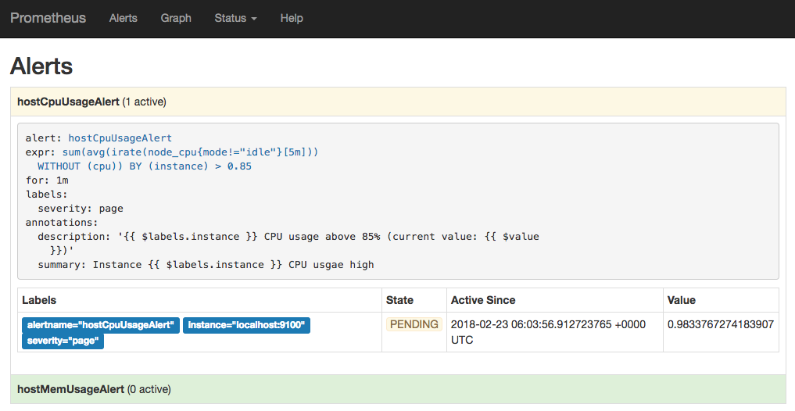
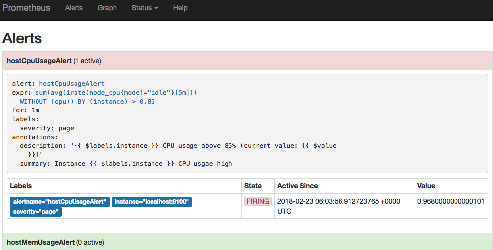
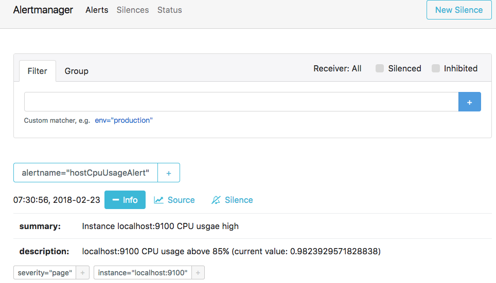

# Prometheus

## 四大指标类型

- Counter：只增不减的计数器，用于描述某个指标的累计状态，比如请求量统计，http_requests_total。重启进程后会被重置
- Gauge：可增可减的计量器，用于描述某个指标当前的状态，比如系统内存余量，node_memory_MemFree。重启进程后会被重置
- Histogram：直方图指标用于描述指标的分布情况，客户端预先定义 Bucket（区间），比如对于请求响应时间，总共10w个请求，小于10ms的有5w个，小于50ms的有9w个，小于100ms的有9.9w个
- Summary：和直方图类似，summary也是用于描述指标分布情况，不过表现形式不同（它提供一个quantiles的功能，可以按%比划分跟踪的结果）。比如还是对于请求响应时间，summary描述则是，总共10w个请求，50%小于10ms，90%小于50ms，99%小于100ms。

### Histogram和Sumamry的区别

- Sumamry的分位数则是直接在客户端计算完成，因此对于分位数的计算而言，Summary在通过PromQL进行查询时有更好的性能表现，而Histogram则会消耗更多的资源。反之对于客户端而言Histogram消耗的资源更少。
- Histogram支持聚合，Summary不支持

示例

Histogram 的 Prometheus 输出

```
http_request_duration_seconds_bucket{le="0.01"} 50000   # ≤10ms 的请求数
http_request_duration_seconds_bucket{le="0.05"} 90000   # ≤50ms 的请求数（含 ≤10ms 的 5w）
http_request_duration_seconds_bucket{le="0.1"} 99000    # ≤100ms 的请求数（含 ≤50ms 的 9w）
http_request_duration_seconds_count 100000              # 总请求数
http_request_duration_seconds_sum 4500                  # 总耗时（秒）
```

Summary 的 Prometheus 输出

```
http_request_duration_seconds{quantile="0.5"} 0.01      # P50=10ms
http_request_duration_seconds{quantile="0.9"} 0.05      # P90=50ms
http_request_duration_seconds{quantile="0.99"} 0.1      # P99=100ms
http_request_duration_seconds_count 100000              # 总请求数
http_request_duration_seconds_sum 4500                  # 总耗时（秒）
```


## prometheus架构


### Prometheus Server

Prometheus Server是Prometheus组件中的核心部分，负责实现对监控数据的**获取，存储以及查询**。

- 获取数据(Retrival)。Prometheus Server可以通过静态配置管理监控目标，也可以配合使用Service Discovery的方式动态管理监控目标，并从这些监控目标中获取数据。
- 存储数据(Storage)。其次Prometheus Server需要对采集到的监控数据进行存储，Prometheus Server本身就是一个时序数据库，将采集到的监控数据按照时间序列的方式存储在本地磁盘当中。
- 查询数据。最后Prometheus Server对外提供了自定义的PromQL语言，实现对数据的查询以及分析。

### Exporter

Exporter将监控数据采集的端点通过HTTP服务的形式暴露给Prometheus Server，Prometheus Server通过访问该Exporter提供的Endpoint端点，即可获取到需要采集的监控数据。

一般来说可以将Exporter分为2类：

- 直接采集：这一类Exporter直接内置了对Prometheus监控的支持，比如cAdvisor，Kubernetes，Etcd，Gokit等，都直接内置了用于向Prometheus暴露监控数据的端点。
- 间接采集：间接采集，原有监控目标并不直接支持Prometheus，因此我们需要通过Prometheus提供的Client Library编写该监控目标的监控采集程序。例如： Mysql Exporter，JMX Exporter，Consul Exporter等。

### AlertManager

AlertManager即Prometheus体系中的告警处理中心。在Prometheus Server中支持基于PromQL创建告警规则，如果满足PromQL定义的规则，则会产生一条告警，而告警的后续处理流程则由AlertManager进行管理。在AlertManager中我们可以与邮件，Slack等等内置的通知方式进行集成，也可以通过Webhook自定义告警处理方式。

### PushGateway

由于Prometheus数据采集基于Pull模型进行设计，因此在网络环境的配置上必须要让Prometheus Server能够直接与Exporter进行通信。 当这种网络需求无法直接满足时，就可以利用PushGateway来进行中转。可以通过PushGateway将内部网络的监控数据主动Push到Gateway当中。而Prometheus Server则可以采用同样Pull的方式从PushGateway中获取到监控数据。

### Service Discovery

在Kubernetes中，pod会随时在创建和被销毁。这种按需的资源使用方式对于监控系统而言就意味着没有了一个固定的监控目标，所有的监控对象(基础设施、应用、服务)都在动态的变化。对于Prometheus这一类基于Pull模式的监控系统，显然也无法继续使用的static_configs的方式静态的定义监控目标。而对于Prometheus而言其解决方案就是引入一个中间的代理人（服务注册中心），这个代理人掌握着当前所有监控目标的访问信息，Prometheus只需要向这个代理人询问有哪些监控目标控即可， 这种模式被称为服务发现。

Prometheus通过使用平台提供的API就可以找到所有需要监控的云主机。在Kubernetes这类容器管理平台中，Kubernetes掌握并管理着所有的容器以及服务信息，那此时Prometheus只需要与Kubernetes打交道就可以找到所有需要监控的容器以及服务对象。Prometheus还可以直接与一些开源的服务发现工具进行集成，例如在微服务架构的应用程序中，经常会使用到例如Consul这样的服务发现注册软件，Promethues也可以与其集成从而动态的发现需要监控的应用服务实例。

## 监控组件

- node_exporter 提供了节点级别的指标，帮助你了解每个节点的健康状况和性能。
- cAdvisor 提供了容器级别的指标，让你了解每个容器的运行状况。
- kube-state-metrics 提供了 Kubernetes 对象的状态指标，帮助你了解 Kubernetes 集群的状态。
  - **Node**：节点的总数、状态（例如，是否处于就绪状态）、CPU 和内存容量等。
  - **Pod**：各个命名空间中的 Pod 数量、Pod 的状态（如 Pending、Running、Succeeded、Failed）、Pod 中的容器数量等。
  - **Deployment**：部署的总数、期望的副本数、当前的副本数、可用的副本数等。
  - **Service**：服务的总数、服务的类型（如 ClusterIP、NodePort、LoadBalancer）等。
  - **Job**：Job 的总数、已完成的 Job 数量、失败的 Job 数量等。
  - **Namespace**：命名空间的总数、各个状态（如 Active、Terminating）的命名空间数量等

## 告警规则

### 告警规则实例配置

1、告警文件

在目录/etc/prometheus/rules/下创建告警文件hoststats-alert.rules内容

- alert：告警规则的名称。
- expr：基于PromQL表达式告警触发条件，用于计算是否有时间序列满足该条件。
- for：评估等待时间，可选参数。用于表示只有当触发条件持续一段时间后才发送告警。在等待期间新产生告警的状态为pending。
- labels：自定义标签，允许用户指定要附加到告警上的一组附加标签。
- annotations：用于指定一组附加信息，比如用于描述告警详细信息的文字等，annotations的内容在告警产生时会一同作为参数发送到Alertmanager

示例：

```
groups:
- name: hostStatsAlert
  rules:
  - alert: hostCpuUsageAlert
    expr: sum(avg without (cpu)(irate(node_cpu{mode!='idle'}[5m]))) by (instance) > 0.85
    for: 1m
    labels:
      severity: page
    annotations:
      summary: "Instance {{ $labels.instance }} CPU usgae high"
      description: "{{ $labels.instance }} CPU usage above 85% (current value: {{ $value }})"
  - alert: hostMemUsageAlert
    expr: (node_memory_MemTotal - node_memory_MemAvailable)/node_memory_MemTotal > 0.85
    for: 1m
    labels:
      severity: page
    annotations:
      summary: "Instance {{ $labels.instance }} MEM usgae high"
      description: "{{ $labels.instance }} MEM usage above 85% (current value: {{ $value }})"
```

2、修改prometheus配置

修改Prometheus配置文件prometheus.yml,添加以下配置

```
rule_files:
  - /etc/prometheus/rules/*.rules
```

3、触发告警

手动拉高系统的CPU使用率，验证Prometheus的告警流程，在主机上运行以下命令：

```
cat /dev/zero>/dev/null
```

Prometheus首次检测到满足触发条件后，hostCpuUsageAlert显示由一条告警处于活动状态。由于告警规则中设置了1m的等待时间，当前告警状态为PENDING，如下图所示：



如果1分钟后告警条件持续满足，则会实际触发告警并且告警状态为FIRING，如下图所示：



## AlertManager

### alertmanager.yml配置文件

Alertmanager主要负责对Prometheus产生的告警进行统一处理，因此在Alertmanager配置中一般会包含以下几个主要部分：

- 全局配置（global）：用于定义一些全局的公共参数，如全局的SMTP配置，Slack配置等内容；
- 模板（templates）：用于定义告警通知时的模板，如HTML模板，邮件模板等；
- 告警路由（route）：根据标签匹配，确定当前告警应该如何处理；
- 接收人（receivers）：接收人是一个抽象的概念，它可以是一个邮箱也可以是微信，Slack或者Webhook等，接收人一般配合告警路由使用；
- 抑制规则（inhibit_rules）：合理设置抑制规则可以减少垃圾告警的产生

示例：

```
global:
  resolve_timeout: 5m
templates:
	[ - <filepath> ... ]
route:
  group_by: ['alertname']
  group_wait: 10s
  group_interval: 10s
  repeat_interval: 1h
  receiver: 'web.hook'
receivers:
- name: 'web.hook'
  webhook_configs:
  - url: 'http://127.0.0.1:5001/'
inhibit_rules:
  - source_match:
      severity: 'critical'
    target_match:
      severity: 'warning'
    equal: ['alertname', 'dev', 'instance']
```

### 关联Prometheus与Alertmanager

编辑Prometheus配置文件prometheus.yml,并添加以下内容

```
alerting:
  alertmanagers:
    - static_configs:
        - targets: ['localhost:9093']
```

查看Alertmanager UI此时可以看到Alertmanager接收到的告警信息



## Recoding Rule

通过PromQL可以实时对Prometheus中采集到的样本数据进行查询，聚合以及其它各种运算操作。而在某些PromQL较为复杂且计算量较大时，直接使用PromQL可能会导致Prometheus响应超时的情况。这时需要一种能够类似于后台批处理的机制能够在后台完成这些复杂运算的计算，对于使用者而言只需要查询这些运算结果即可。Prometheus通过Recoding Rule规则支持这种后台计算的方式，可以实现对复杂查询的性能优化，提高查询效率。

示例：每个实例在 5 分钟内非空闲的 CPU 使用比率

```
groups:
- name: record_cpu_usage
  interval: 30s
  rules:
  - record: instance:cpu_usage:rate5m
    expr: sum by(instance)(rate(node_cpu_seconds_total{mode!="idle"}[5m]))
```

# Grafana

Grafana是一个通用的可视化工具

## Data Source

Prometheus，OpenTSDB，Elasticsearch，Mysql等

## Dashboard

在一个Dashboard中一个最基本的可视化单元为一个**Panel（面板）**，Panel通过如趋势图，热力图的形式展示可视化数据。 并且在Dashboard中每一个Panel是一个完全独立的部分，通过Panel的**Query Editor（查询编辑器）**我们可以为每一个Panel设置查询的数据源及数据查询方式。

例如，如果以Prometheus作为数据源，那在Query Editor中，我们实际上使用的是PromQL，而Panel则会负责从特定的Prometheus中查询出相应的数据，并且将其可视化。由于每个Panel是完全独立的，因此在一个Dashboard中，往往可能会包含来自多个Data Source的数据。

### Pannel种类

Graph Panel，Heatmap Panel，SingleStat Panel以及Table Panel

# CICD

## Devops

DevOps是一种软件开发方法论，它强调开发（Dev）和运维（Ops）两个部分的紧密合作以提高系统的交付效率和产品质量。目标是更短的发布周期，更高的部署频率，以及能更快地修复问题

## CI

CI（Continuous Integration）是持续集成，开发人员在开发过程中频繁地将代码集成到主分支。每次集成都通过自动化的构建（包括编译、发布、自动化测试）来验证，以便尽早发现集成错误

## CD

持续交付（Continuous Delivery），开发人员对软件的更改在构建后尽快交付给用户。目标是构建、测试和发布软件更快、更频繁。每一个通过CI测试的更改都可以被视为准备好交付的候选版本。

持续部署（Continuous Deployment）是持续交付的下一步，不仅将更改交付给用户进行测试，而且在通过测试后将这些更改自动部署到生产环境。这意味着每一次更改后的应用，只要通过了所有的自动化测试，都会自动部署到生产环境

## 敏捷开发

敏捷开发是一种软件开发方法，它强调灵活性和客户合作，以应对需求和解决方案的快速变化。这种方法的核心是通过迭代和增量开发来适应这种变化，每次迭代都会产出一个可工作的产品增量。敏捷开发注重提高客户满意度，欢迎并适应需求变更，频繁地交付可工作的软件
